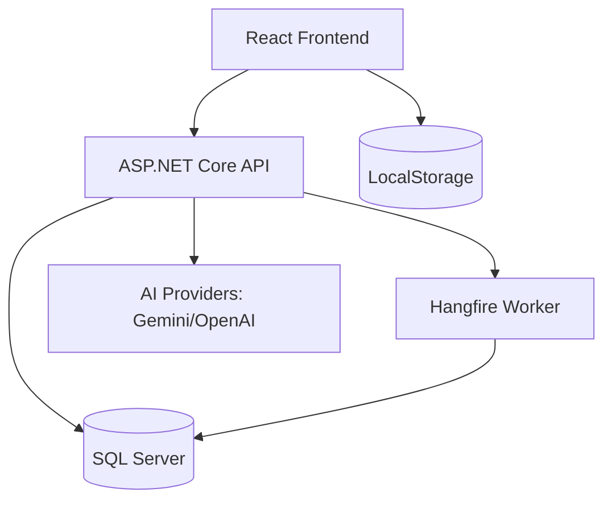
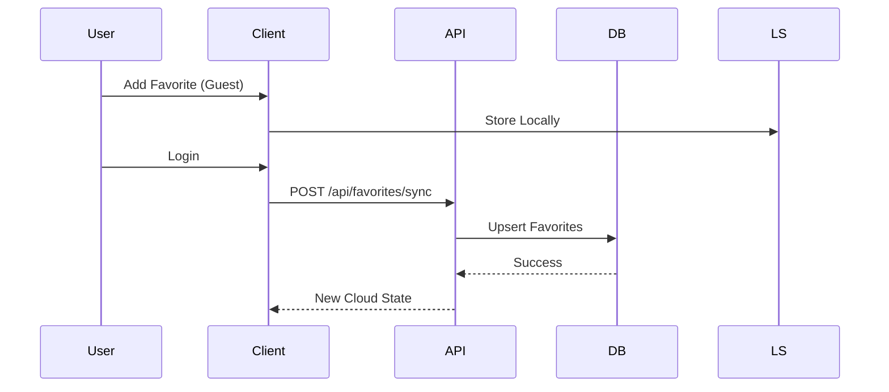

# 🌲 EcoProject Technical Onboarding Guide

*Generated: 2026-03-28*

Welcome to the **EcoProject** (Plaminski Pateki). This document serves as your technical map to the codebase, architecture, and development workflows.

---

## 1. README / Instruction Files Summary

The project is an interactive platform for exploring eco-trails in Bulgaria, featuring GIS visualization, AI-driven recommendations, and user favorites synchronization.

### Key Documentation:
- **[README.md](./README.md):** The primary entry point. Covers system architecture, quick start with Docker, AI assistant setup, and the GIS layer.
- **[TESTING.md](./TESTING.md):** Detailed guide on unit and integration testing, including test filtering and smoke scripts.
- **[scripts/data-quality/synthetic-governance-workflow-2026-03-21.md](./scripts/data-quality/synthetic-governance-workflow-2026-03-21.md):** Governance workflow for AI-enriched data.

---

## 2. Detailed Technology Stack

The project follows a modern full-stack architecture with a focus on high performance and observability.

| Layer | Technology | Configuration / Entry Point |
| :--- | :--- | :--- |
| **Backend** | ASP.NET Core 10 Web API | [EcoTrails.Api/EcoTrails.Api.csproj](./EcoTrails.Api/EcoTrails.Api.csproj) |
| **Frontend** | React 18 + TypeScript (Vite) | [EcoTrails.Client/package.json](./EcoTrails.Client/package.json) |
| **Database** | SQL Server (MSSQL 2022) | [docker-compose.yml](./docker-compose.yml) |
| **ORM** | Entity Framework Core 10 | [EcoTrails.Api/Data/AppDbContext.cs](./EcoTrails.Api/Data/AppDbContext.cs) |
| **Auth** | ASP.NET Core Identity + JWT | [EcoTrails.Api/Program.cs](./EcoTrails.Api/Program.cs#L173-L221) |
| **Mapping** | Leaflet + Marker Clustering | [EcoTrails.Client/src/components/MapComponent.tsx](./EcoTrails.Client/src/components/MapComponent.tsx) |
| **Jobs** | Hangfire | [EcoTrails.Api/Program.cs](./EcoTrails.Api/Program.cs#L164-L172) |
| **Observability** | OpenTelemetry + Serilog | [EcoTrails.Api/Program.cs](./EcoTrails.Api/Program.cs#L29-L49) |

---

## 3. System Overview and Purpose

**Plaminski Pateki** solves the problem of finding and analyzing mountain trails in Bulgaria. It aggregates data for 500+ routes, providing:
- **GIS Visualization:** Interactive maps with clumping/spiderfying markers.
- **Hybrid Favorites Sync:** LocalStorage for quick access, synced to the cloud upon login.
- **AI Recommendations:** Intelligent "Assistant" chat that provides trail suggestions based on user queries, weather, and trail metadata.
- **Data Governance:** Human-in-the-loop (HITL) workflows for synthetic data enrichment.

---

## 4. Project Structure & Reading Order

### Entry Points
- **Backend:** [EcoTrails.Api/Program.cs](./EcoTrails.Api/Program.cs) (Services, DI, and Middleware).
- **Frontend:** [EcoTrails.Client/src/main.tsx](./EcoTrails.Client/src/main.tsx) (React bootstrapping).

### General Organization
```text
.
├── EcoTrails.Api/           # Backend Mono-repo
│   ├── Controllers/         # API Layer (REST Endpoints)
│   ├── Data/                # EF Core Context & Migrations
│   ├── Models/              # Domain Models (Database Schema)
│   ├── Repositories/        # Data Access Layer
│   └── Services/            # Business Logic & AI Orchestration
├── EcoTrails.Client/        # Frontend Mono-repo
│   ├── src/
│   │   ├── components/      # UI Components (Reusable)
│   │   ├── pages/           # View Containers
│   │   └── services/        # API Clients (Axios/Fetch)
└── scripts/                 # PowerShell/Bash utilities
```

### Suggested Reading Order (First 5 Files)
1. [EcoTrails.Api/Program.cs](./EcoTrails.Api/Program.cs) - Backend configuration.
2. [EcoTrails.Api/Models/Trail.cs](./EcoTrails.Api/Models/Trail.cs) - Core domain model.
3. [EcoTrails.Client/src/App.tsx](./EcoTrails.Client/src/App.tsx) - Frontend routing and layout.
4. [EcoTrails.Api/Controllers/TrailsController.cs](./EcoTrails.Api/Controllers/TrailsController.cs) - Main API interaction.
5. [EcoTrails.Client/src/services/apiClient.ts](./EcoTrails.Client/src/services/apiClient.ts) - Frontend-Backend glue.

---

## 5. Key Components

### 🗺️ GIS Layer (`MapComponent.tsx`)
Handles Leaflet initialization and marker clustering.
```tsx
// EcoTrails.Client/src/components/MapWidget.tsx
const MapWidget = ({ trails, onTrailSelect }: MapWidgetProps) => {
  return (
    <MapContainer center={[42.7, 25.3]} zoom={7}>
      <TileLayer url="https://{s}.tile.openstreetmap.org/{z}/{x}/{y}.png" />
      <MarkerClusterGroup>
        {trails.map(trail => (
          <Marker key={trail.id} position={[trail.latitude, trail.longitude]} />
        ))}
      </MarkerClusterGroup>
    </MapContainer>
  );
};
```

### 🤖 AI Assistant (`AssistantController.cs`)
Orchestrates chat sessions with Gemini/OpenAI.
```csharp
// EcoTrails.Api/Controllers/AssistantController.cs
[HttpPost("chat")]
public async Task<ActionResult<AssistantChatResponse>> Chat([FromBody] AssistantChatRequest request)
{
    var response = await _orchestrationService.ProcessPromptAsync(request);
    return Ok(response);
}
```

---

## 6. Execution and Data Flows

### General Data Flow
1. **Frontend:** User filters trails -> `HomePage` triggers `trailService.getTrails()`.
2. **API:** `TrailsController` handles request -> calls `TrailRepository`.
3. **Repository:** Executes LINQ query against `AppDbContext`.
4. **DB:** SQL Server returns Paged Results.
5. **API:** `X-Total-Count` header attached -> JSON returned.

### Database Schema (Key Models)
- **`Trails`**: Core route data (Name, Region, Difficulty, Coordinates).
- **`Users`**: AspNetUsers (Identity).
- **`UserFavoriteTrails`**: Junction table for favorites (Many-to-Many).
- **`AssistantChatSessions`**: Persistent AI conversations.

---

## 7. Dependencies, Integrations & APIs

- **External Integrations:**
    - **OpenRouteService:** Geocoding and routing metrics.
    - **OpenAI / Gemini:** LLM providers for the Assistant.
    - **Open-Meteo:** Live weather context for trail recommendations.
- **API Documentation:**
    - Swagger UI available at `/swagger` when running in Development.
    - Configured in [EcoTrails.Api/Program.cs](./EcoTrails.Api/Program.cs#L296-L309).

---

## 8. Architecture Diagrams

### Component Diagram


### Data Flow Diagram (Sync)


---

## 9. Testing, Error Handling & Security

- **Testing:** `xUnit` for unit/integration tests. Located in `EcoTrails.Api.Tests`.
- **Error Handling:** Global middleware `GlobalExceptionHandlingMiddleware.cs`. Returns standard `ProblemDetails`.
- **Security:**
    - **Authentication:** JWT Bearer tokens.
    - **Rate Limiting:** Fixed window limiter (Auth) and Token bucket (Assistant).
    - **Authorization:** `[Authorize]` and Admin-only role checks.

---

## 10. DevOps & Build

- **Docker:** `Dockerfile` for both API and Client. `docker-compose.yml` for local orchestration.
- **CI/CD:** GitHub Actions workflows in `.github/workflows/`:
    - `ci.yml`: Build and test API/Client.
    - `synthetic-governance-audit.yml`: Scheduled data audits.
- **Deployment:** Production deployment uses `docker-compose.prod.yml` and `.env.production`.
