# Диаграма на класовете (Backend домейн + AI услуги)

Обхват: Основни domain entity-та в AppDbContext и ключовите изградени AI service интерфейси.
Файл: `01-class-diagram.md` — Mermaid source за draw.io import.

```mermaid
classDiagram
    %% ─── Domain entities ───
    class AppDbContext {
        +DbSet~Trail~ Trails
        +DbSet~UserFavoriteTrail~ UserFavoriteTrails
        +DbSet~AssistantChatSession~ AssistantChatSessions
        +DbSet~AssistantChatEntry~ AssistantChatEntries
        +DbSet~TrailEnrichmentSnapshot~ TrailEnrichmentSnapshots
        +DbSet~CommunityTrailPost~ CommunityTrailPosts
        +DbSet~CommunityTrailPostImage~ CommunityTrailPostImages
    }

    class AppUser {
        +Id : string
        +Email : string
        +FavoriteTrails : ICollection~UserFavoriteTrail~
        +CommunityPosts : ICollection~CommunityTrailPost~
    }

    class Trail {
        +Id : int
        +Name : string
        +Description : string
        +Location : string
        +Region : string
        +DifficultyLevel : TrailDifficultyLevel
        +WaterSources : bool
        +MaxAltitude : int?
        +SuitableForKids : bool
        +RequiredGear : string
        +DurationInHours : double
        +ElevationGain : int
        +Latitude : double?
        +Longitude : double?
        +EmbeddingVector : string?
        +EmbeddingModel : string?
        +EmbeddingUpdatedAt : DateTime?
    }

    class UserFavoriteTrail {
        +UserId : string
        +TrailId : int
    }

    class AssistantChatSession {
        +Id : int
        +SessionId : string
        +Title : string
        +AppUserId : string
        +LastActivityAt : DateTime
    }

    class AssistantChatEntry {
        +Id : int
        +SessionInternalId : int
        +Role : string
        +Content : string
        +CreatedAt : DateTime
    }

    class TrailEnrichmentSnapshot {
        +Id : int
        +TrailId : int
        +GeneratedAtUtc : DateTime
        +PayloadJson : string
        +HasVerifiedSource : bool
    }

    class CommunityTrailPost {
        +Id : int
        +AppUserId : string
        +TrailId : int?
        +Title : string
        +Content : string
        +PostType : CommunityPostType
        +ProposalStatus : ProposalStatus?
        +ReviewedAtUtc : DateTime?
        +CreatedAtUtc : DateTime
    }

    class CommunityTrailPostImage {
        +Id : int
        +CommunityTrailPostId : int
        +ImageUrl : string
        +StoragePath : string
    }

    %% ─── AI assistant service интерфейси ───
    class IAssistantPromptSafetyService {
        <<interface>>
        +IsPotentialPromptInjection(prompt) bool
        +SanitizePrompt(prompt) string
    }

    class IAssistantRetrievalService {
        <<interface>>
        +FindRelevantTrailsAsync(query, request) List~AssistantTrailContext~
        +GetAlternativeTrailsAsync(query, excludeIds) List~AssistantTrailContext~
    }

    class IAssistantProvenancePolicyService {
        <<interface>>
        +BuildContextAsync(trails, alternatives) AssistantProvenanceContextResult
    }

    class IAssistantWeatherContextService {
        <<interface>>
        +BuildWeatherContextAsync(prompt, trails) string?
    }

    class IAssistantPromptAssemblyService {
        <<interface>>
        +ResolveAssistantMode() string
        +BuildSystemInstruction(mode, hasWarning, isInjection) string
        +BuildUserPromptByMode(mode, request, ...) string
    }

    class IAssistantResponseCompositionService {
        <<interface>>
        +FormatAssistantReply(reply, trails, alternatives) string
        +BuildKnowledgeChips(trails) List~string~
    }

    class IAssistantSessionOrchestrationService {
        <<interface>>
        +GetOrCreateSessionAsync(sessionId, prompt, userId) AssistantChatSession
        +UpdateSessionTitleAsync(session, reply) Task
    }

    class IAiProviderFallbackPolicy {
        <<interface>>
        +ShouldFallbackToSecondaryModel() bool
        +ShouldFallbackToOpenAiFromGemini() bool
    }

    class IAiProviderClient {
        <<interface>>
        +SendOpenAiRequestAsync(model, messages, ...) string
        +SendGeminiRequestAsync(model, prompt, ...) string
    }

    %% ─── Релации между entity-та ───
    AppDbContext --> Trail
    AppDbContext --> UserFavoriteTrail
    AppDbContext --> AssistantChatSession
    AppDbContext --> AssistantChatEntry
    AppDbContext --> TrailEnrichmentSnapshot
    AppDbContext --> CommunityTrailPost
    AppDbContext --> CommunityTrailPostImage

    AppUser "1" --> "*" UserFavoriteTrail : любими
    Trail "1" --> "*" UserFavoriteTrail : любими от
    AssistantChatSession "1" --> "*" AssistantChatEntry : съобщения
    Trail "1" --> "*" TrailEnrichmentSnapshot : обогатявания
    AppUser "1" --> "*" CommunityTrailPost : публикации
    Trail "0..1" --> "*" CommunityTrailPost : свързана пътека
    CommunityTrailPost "1" --> "*" CommunityTrailPostImage : изображения
```

