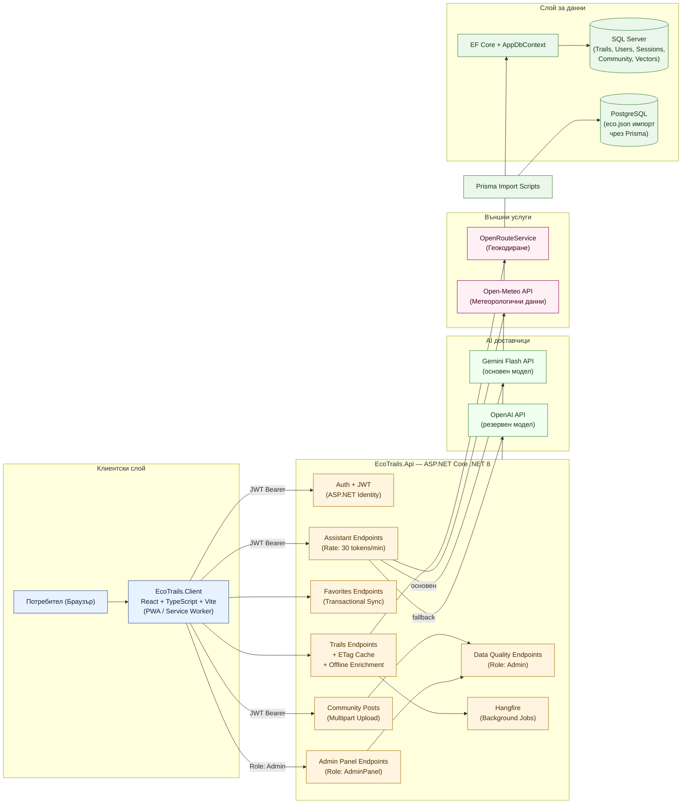

# Диаграма: Архитектура Frontend–Backend (Обзор)

Обхват: Структурна обзорна диаграма на комуникационните канали между слоевете на приложението.
Файл: `02-frontend-backend-diagram.md` — Mermaid source за draw.io import.

