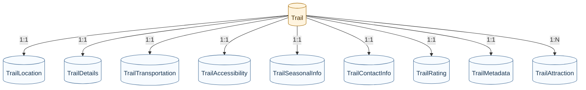

# Database Schema Diagram (Prisma PostgreSQL)

```mermaid
flowchart TB
    Trail[(Trail)]
    TrailLocation[(TrailLocation)]
    TrailDetails[(TrailDetails)]
    TrailTransportation[(TrailTransportation)]
    TrailAccessibility[(TrailAccessibility)]
    TrailSeasonalInfo[(TrailSeasonalInfo)]
    TrailContactInfo[(TrailContactInfo)]
    TrailRating[(TrailRating)]
    TrailMetadata[(TrailMetadata)]
    TrailAttraction[(TrailAttraction)]

    Trail -->|1:1| TrailLocation
    Trail -->|1:1| TrailDetails
    Trail -->|1:1| TrailTransportation
    Trail -->|1:1| TrailAccessibility
    Trail -->|1:1| TrailSeasonalInfo
    Trail -->|1:1| TrailContactInfo
    Trail -->|1:1| TrailRating
    Trail -->|1:1| TrailMetadata
    Trail -->|1:N| TrailAttraction

    classDef core fill:#fff4df,stroke:#a66a00,color:#4a2f00;
    classDef child fill:#f7fbff,stroke:#406a95,color:#16334f;
    class Trail core;
    class TrailLocation,TrailDetails,TrailTransportation,TrailAccessibility,TrailSeasonalInfo,TrailContactInfo,TrailRating,TrailMetadata,TrailAttraction child;
```
