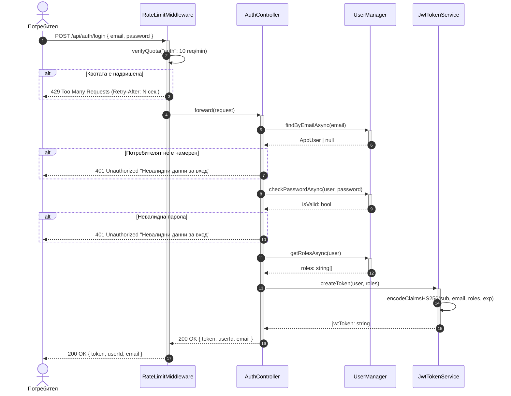

# Sequence Diagram: Успешна автентикация (Вход)

Обхват: Сценарий „Потребителят въвежда валидни данни и получава JWT токен".  
Alt-ветви: надвишена квота (429), непознат имейл (401), невалидна парола (401).  
Файл: `05-sequence-login.md` — Mermaid source за draw.io import.

