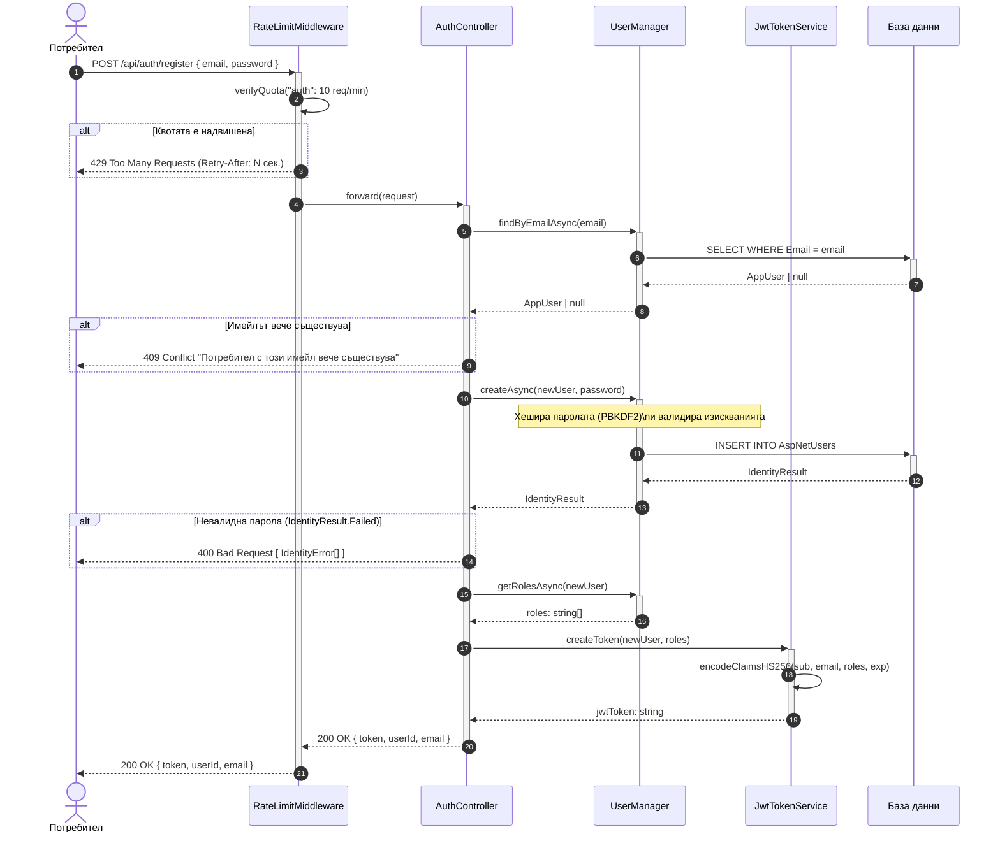

# Sequence Diagram: Регистрация на потребител

Обхват: Сценарий „Нов потребител се регистрира и получава JWT токен".  
Alt-ветви: надвишена квота (429), дублиран имейл (409), слаба парола (400).  
Файл: `06-sequence-register.md` — Mermaid source за draw.io import.

