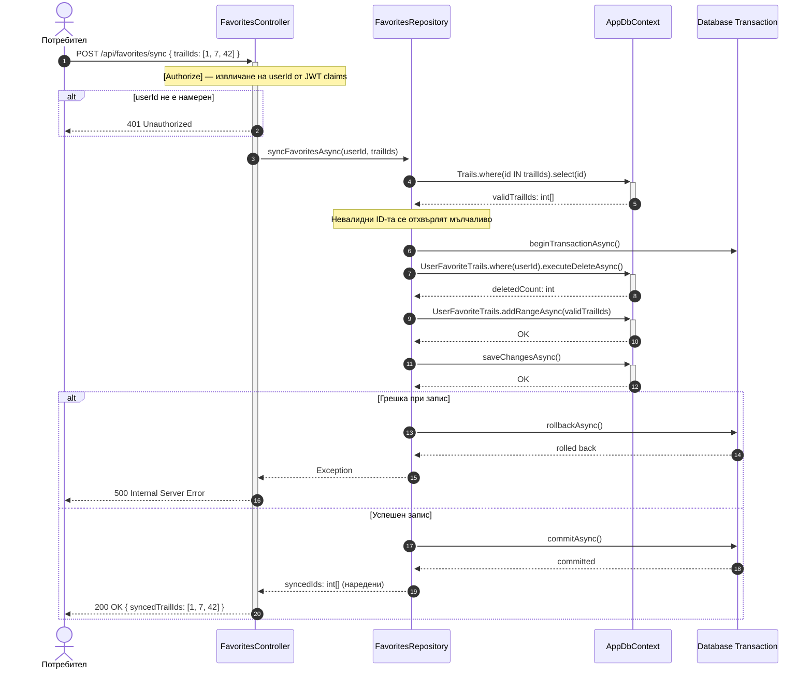

# Sequence Diagram: Синхронизация на любими пътеки (транзакция)

Обхват: Сценарий „Автентикиран потребител синхронизира своя списък с любими".  
Alt-ветви: неавторизиран (401), транзакционен rollback при грешка в БД.  
Файл: `08-sequence-favorites-sync.md` — Mermaid source за draw.io import.

