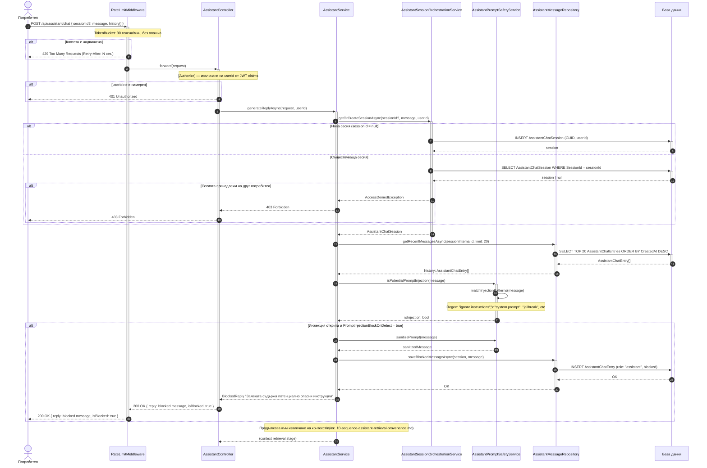

# Sequence Diagram: Сесия на AI асистент и проверка за безопасност

Обхват: Сценарий „Клиентът изпраща съобщение; системата извлича/създава сесия и проверява за prompt injection".  
Alt-ветви: неавторизиран (401), надвишена квота (429), достъп до чужда сесия (403), блокиран prompt injection.  
Файл: `09-sequence-assistant-session-safety.md` — Mermaid source за draw.io import.

