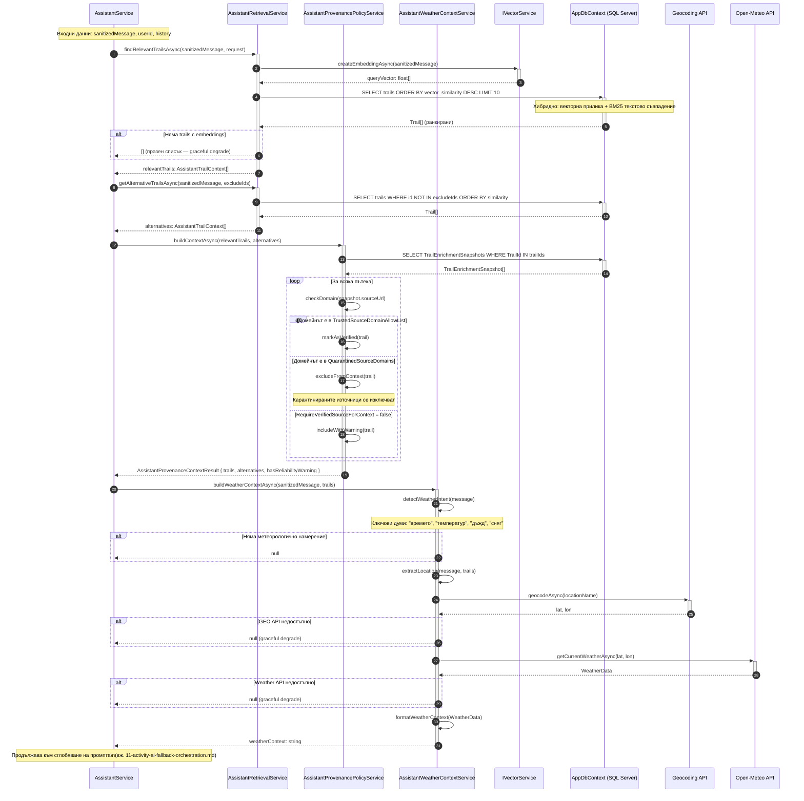

# Sequence Diagram: Извличане на контекст и верификация на произход (RAG + Provenance)

Обхват: Сценарий „Системата извлича релевантни пътеки чрез хибридно търсене, проверява произхода на данните и добавя метеорологичен контекст".  
Alt-ветви: липса на embeddings (graceful degrade), карантинен домейн (изключване), недостъпно метео API (null fallback).  
Файл: `10-sequence-assistant-retrieval-provenance.md` — Mermaid source за draw.io import.

