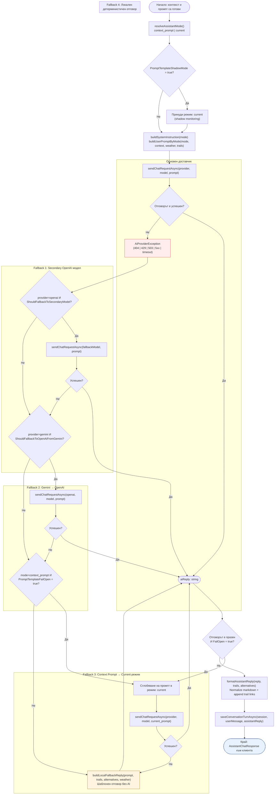

# Activity Diagram: Оркестрация на AI доставчик с многостепенен Fallback

Обхват: Сценарий „Системата избира AI доставчик, изпраща промпт и прилага многостепенна fallback стратегия при грешки".  
Нива: Gemini (основен) → OpenAI (резервен) → Secondary OpenAI модел → Локален детерминистичен отговор.  
Файл: `11-activity-ai-fallback-orchestration.md` — Mermaid source за draw.io import.

