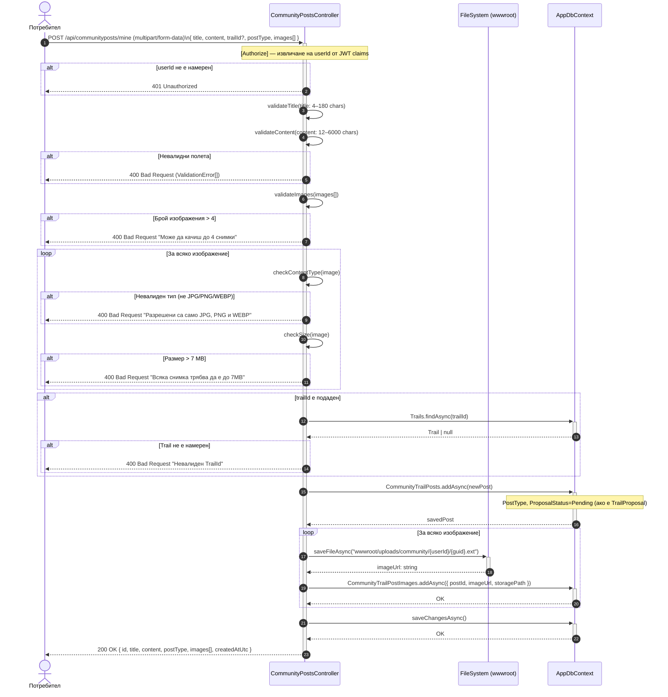

# Sequence Diagram: Създаване на публикация в общността (с качване на изображения)

Обхват: Сценарий „Автентикиран потребител публикува пост с изображения; системата валидира и записва файловете".  
Alt-ветви: неавторизиран (401), твърде голям файл (400), твърде много изображения (400), невалиден тип файл (400), невалиден TrailId (400).  
Файл: `12-sequence-community-post-create.md` — Mermaid source за draw.io import.

