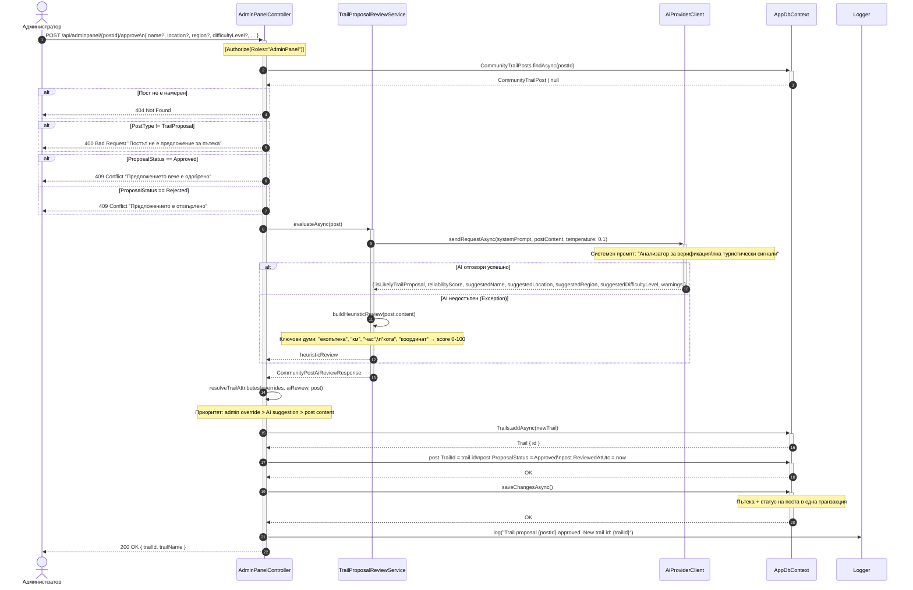

# Sequence Diagram: Одобряване на предложение за пътека от администратор

Обхват: Сценарий „Администратор одобрява пост-предложение; системата извършва AI преглед и създава нова пътека атомарно".  
Alt-ветви: пост не е намерен (404), не е предложение (400), вече одобрено/отхвърлено (409), AI недостъпен (heuristic fallback).  
Файл: `13-sequence-admin-proposal-approval.md` — Mermaid source за draw.io import.

