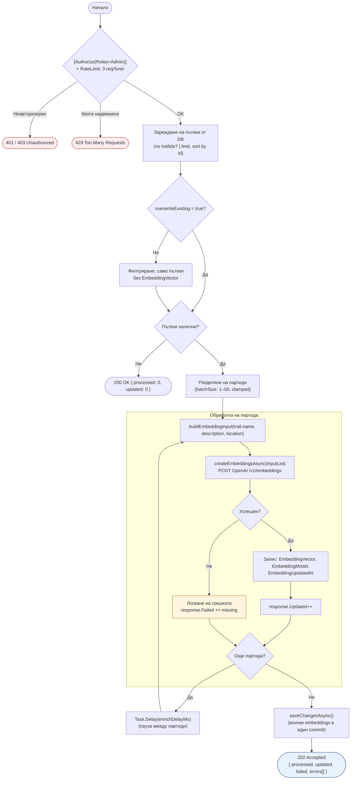

# Activity Diagram: Векторно индексиране за семантично търсене

Обхват: Сценарий „Администратор стартира пакетно индексиране на embeddings за пътеките; системата обработва на партиди с устойчивост при частични грешки".  
Alt-ветви: неавторизиран (401/403), надвишена квота (429), частична пакетна грешка (продължава), всички партиди неуспешни (връща Failed count).  
Файл: `14-activity-vector-indexing.md` — Mermaid source за draw.io import.

