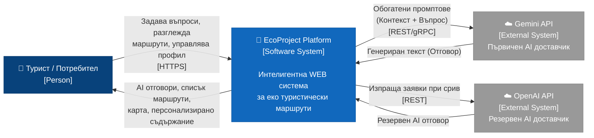

# 15 – C4 Level 1: Диаграма на системния контекст

## Описание

**Тип:** C4 Model – Level 1 (System Context)

| Елемент | Тип | Описание |
|---------|-----|----------|
| Турист / Потребител | Person | Краен потребител – регистриран или анонимен посетител |
| EcoProject Platform | Software System | Цялата система – Frontend + Backend + данни |
| Gemini API | External System | Google AI – първичен LLM доставчик (Gemini Flash) |
| OpenAI API | External System | OpenAI – резервен LLM при недостъпност на Gemini |

**Ключови потоци:**
- Потребителят взаимодейства само с EcoProject Platform
- Platform оркестрира комуникацията с AI провайдъри
- Fallback логика: Gemini → OpenAI при HTTP 429/5xx
