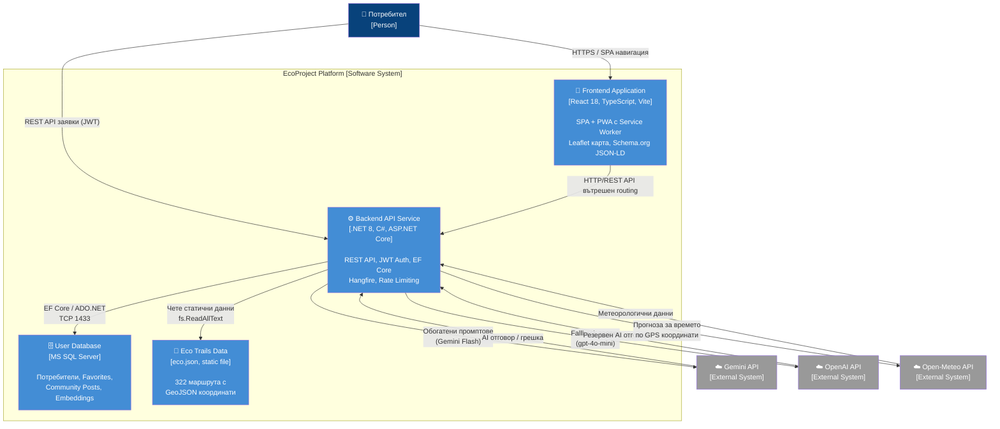

# 16 – C4 Level 2: Диаграма на контейнерите

## Описание

**Тип:** C4 Model – Level 2 (Container Diagram)

| Контейнер | Технология | Порт | Описание |
|-----------|-----------|------|----------|
| Frontend | React 18 + TS + Vite | 3000 (dev) / 80 (prod) | SPA с PWA, офлайн кеш, карта |
| Backend API | .NET 8 Kestrel | 8080 / 443 | REST API, Hangfire background jobs |
| User Database | MS SQL Server | 1433 | EF Core Code-First миграции |
| Eco Trails Data | JSON file (eco.json) | – | 322 статични маршрута |
| Gemini API | Google AI REST/gRPC | 443 | Първичен LLM (Gemini 2.0 Flash) |
| OpenAI API | OpenAI REST | 443 | Fallback LLM (gpt-4o-mini) |
| Open-Meteo API | REST | 443 | Безплатна прогноза за времето |
