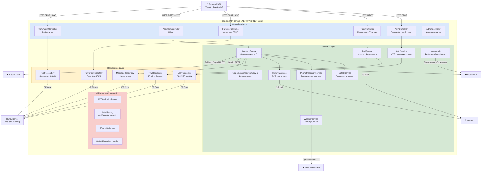

# 17 – C4 Level 3: Диаграма на компонентите (Backend API)

## Описание

**Тип:** C4 Model – Level 3 (Component Diagram) – Backend API Application

| Слой | Компонент | Отговорност |
|------|-----------|-------------|
| Controllers | AuthController | Регистрация, вход, JWT refresh |
| Controllers | TrailsController | Списък, търсене, ETag кеш |
| Controllers | AssistantController | AI чат с rate limiting |
| Controllers | FavoritesController | Управление на любими маршрути |
| Services | AssistantService | Orchestration: Safety → Assembly → Model → Compose |
| Services | RetrievalService | RAG: семантично търсене в eco.json |
| Services | PromptAssemblyService | Съставя контекст: маршрути + времето + история |
| Services | SafetyService | Блокира опасни/нерелевантни промпти |
| Repositories | TrailRepository | Достъп до SQL + векторни полета |
| Middleware | Rate Limiting | Token bucket: 30 req/min за assistant |
