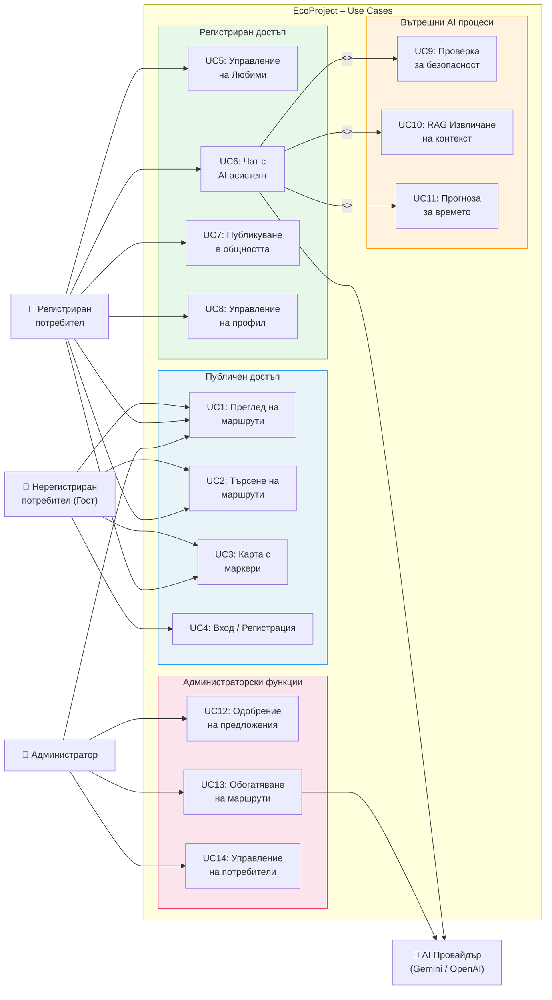

# 18 – Use Case диаграма: EcoProject

## Описание

**Тип:** Use Case диаграма

| Актьор | Роля | Достъпни UC |
|--------|------|-------------|
| Гост | Анонимен потребител | UC1–UC4 (само четене) |
| Регистриран потребител | Автентикиран с JWT | UC1–UC8 |
| Администратор | Role: Admin | UC12–UC14 + всички останали |
| AI Провайдър | Gemini Flash / gpt-4o-mini | Асинхронни отговори |

**Релации:**
- `UC6 <<include>> UC9` – Всеки чат задължително минава Safety проверка
- `UC6 <<include>> UC10` – Всеки чат извлича RAG контекст
- `UC6 <<extend>> UC11` – Времето се добавя само при маршрутни запитвания
