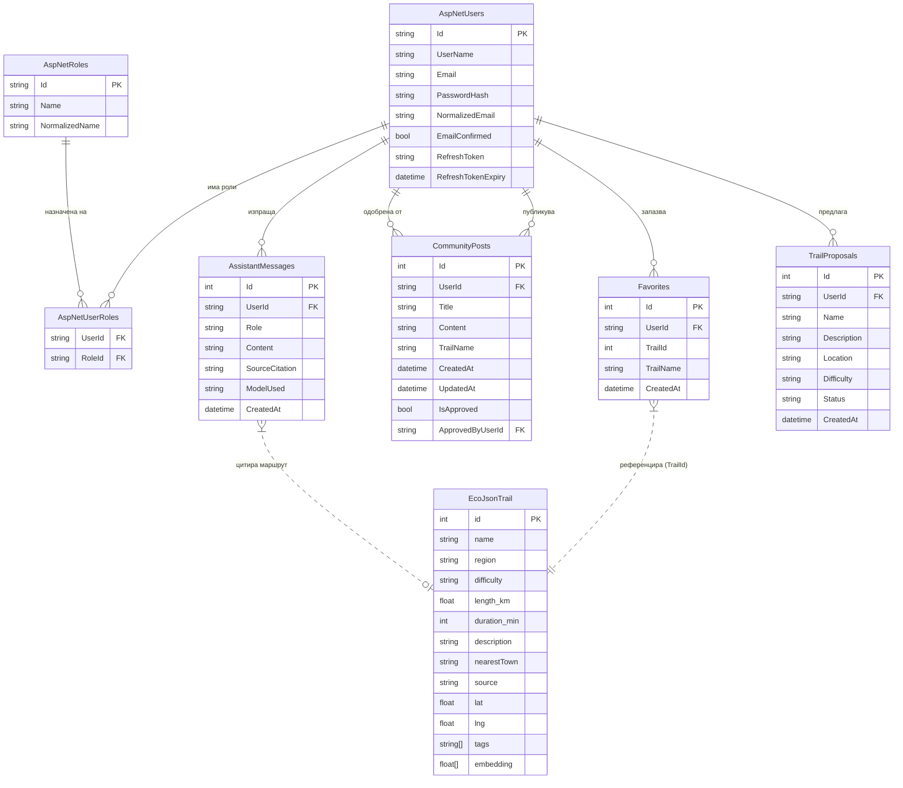

# 19 – ER Диаграма: Хибриден модел (SQL Server + eco.json)

## Описание

**Тип:** ER Диаграма – Хибриден модел

### Хибридна архитектура на данните

| Хранилище | Технология | Данни |
|-----------|-----------|-------|
| SQL Server (EF Core) | Релационна БД | Потребители, Favorites, Posts, Messages |
| eco.json (статичен файл) | JSON (322 записа) | Маршрути с GPS, описания, тагове, embeddings |

### Ключови особености
- `Favorites.TrailId` → референцира `id` от `eco.json` (не Foreign Key в SQL)
- `AssistantMessages.SourceCitation` → JSON низ с имена на маршрути от eco.json
- `EcoJsonTrail.embedding` → float[1536] вектор за семантично търсене (cosine similarity)
- ASP.NET Core Identity управлява `AspNetUsers`, `AspNetRoles`, `AspNetUserRoles`
- `CommunityPosts.IsApproved` + `ApprovedByUserId` → workflow за одобрение от Admin
