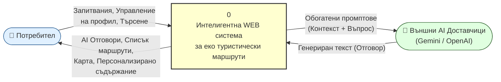

# 20 – DFD Level 0: Контекстна диаграма

## Описание

**Тип:** DFD Level 0 – Контекстна диаграма (черна кутия)

| Елемент | Тип | Описание |
|---------|-----|----------|
| Потребител | Външна единица | Туристи, регистрирани потребители |
| Система (0) | Процес | Цялата EcoProject система – единичен процес |
| AI Доставчици | Zewnętrzna единица | Gemini Flash + OpenAI GPT-4o-mini |

**Цел:** Показва границата на системата и всички входящи/изходящи потоци на данни без детайли за вътрешната структура.
