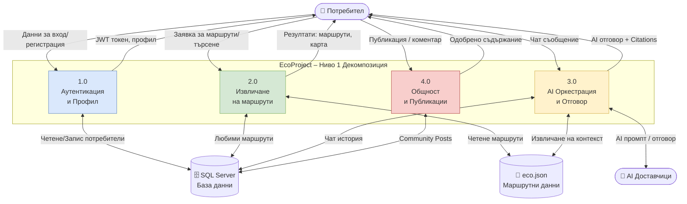

# 21 – DFD Level 1: Основни подсистеми

## Описание

**Тип:** DFD Level 1 – Основни подсистеми

| Процес | Описание | Входни данни | Изходни данни |
|--------|----------|-------------|--------------|
| 1.0 Аутентикация | JWT auth, ASP.NET Identity | Credentials | JWT + Refresh токен |
| 2.0 Извличане | Маршрути, търсене, карта | Search params | Trail списък, GeoJSON |
| 3.0 AI Оркестрация | Safety → RAG → LLM → Format | Чат съобщение | AI отговор + Citations |
| 4.0 Общност | Community Posts, одобрение | Публикация | Одобрено съдържание |

**Хранилища:**
- SQL Server: Потребители, Favorites, Messages, Posts
- eco.json: 322 маршрута (статичен файл, чете се от процеси 2.0 и 3.0)
