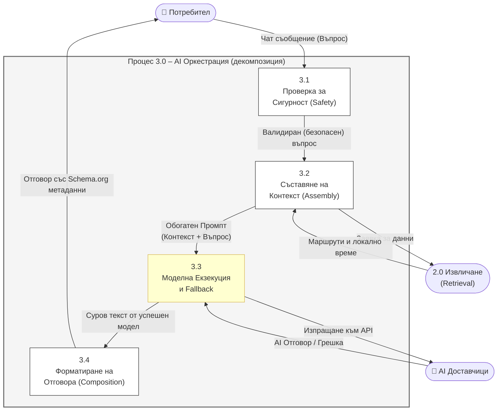

# 22 – DFD Level 2: Декомпозиция на Процес 3.0 (AI Оркестрация)

## Описание

**Тип:** DFD Level 2 – Декомпозиция на Процес 3.0 (AI Оркестрация)

| Под-процес | Клас / Сервиз | Описание |
|-----------|---------------|----------|
| 3.1 Safety | `SafetyService` | Блокира опасни/нерелевантни промпти |
| 3.2 Assembly | `PromptAssemblyService` | Конструира обогатен промпт с контекст |
| 3.3 Execution | `AssistantService` | Извиква Gemini Flash → при грешка OpenAI |
| 3.4 Composition | `ResponseCompositionService` | Добавя Schema.org JSON-LD и citations |

**Ключови правила:**
- Процес 3.1 блокира при: заплахи, offensive съдържание, prompt injection
- Процес 3.2 включва: top-5 маршрути по cosine similarity + прогноза за времето
- Процес 3.3 прилага exponential backoff при HTTP 429/503 от Gemini
- Процес 3.4 форматира markdown + JSON-LD за Schema.org `HowToStep`
