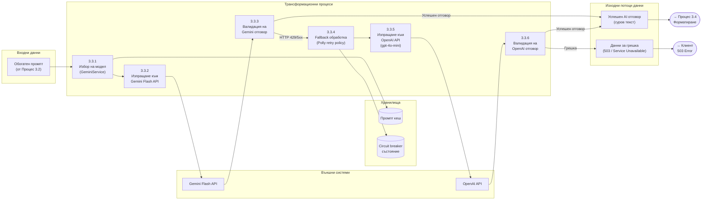

# 23 – DFD Level 3: Декомпозиция на Процес 3.3 (Моделна Екзекуция и Fallback)

## Описание

**Тип:** DFD Level 3 – Декомпозиция на Процес 3.3 (Моделна Екзекуция)

**Основни елементи (DFD стандарт):**

| Елемент | Значение | Пример |
|---------|---------|--------|
| Процес (правоъгълник) | Трансформация на данни | 3.3.2 Изпращане към Gemini |
| Поток данни (стрелка) | Движение на данни между процеси | Успешен отговор → OUT1 |
| Хранилище (цилиндър) | Данни в покой | Промпт кеш, Circuit breaker |
| Външни системи (правоъгълник) | API / Източник | Gemini Flash, OpenAI |

**Входове:**
- Обогатен промпт (от Процес 3.2)

**Процеси:**
- 3.3.1: Избор модел + проверка на кеш
- 3.3.2-3.3.3: Gemini API + валидация отговора
- 3.3.4: Fallback обработка (Polly retry policy с exponential backoff 1s/2s/4s)
- 3.3.5-3.3.6: OpenAI API + валидация отговора

**Изходи:**
- **Успешен отговор** → Процес 3.4 (Форматиране)
- **Грешка** → 503 Service Unavailable към клиента

**Забележка:** Конкретните условия (HTTP статус кодове, retry логика) са детайли на имплементацията, а не част от DFD абстракцията. DFD показва само данните, които влизат, минават през процеси и излизат.
