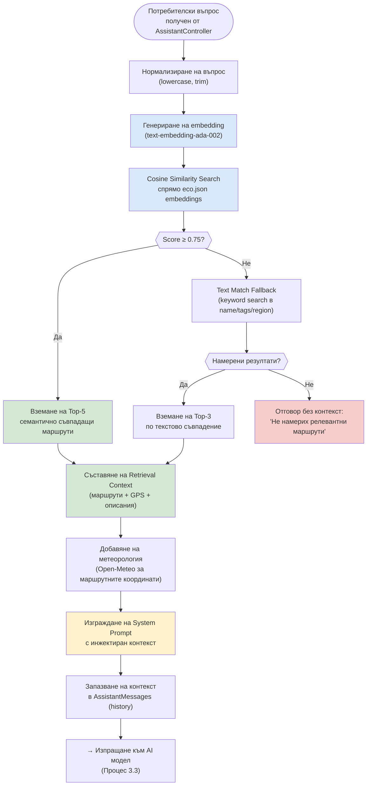

# 24 – Activity Diagram: RAG Pipeline (Retrieval-Augmented Generation)

## Описание

**Тип:** Activity Diagram – RAG (Retrieval-Augmented Generation) Pipeline

| Стъпка | Компонент | Технология |
|--------|-----------|-----------|
| Embedding generation | `RetrievalService` | text-embedding-ada-002 (или локален модел) |
| Cosine similarity search | `TrailSearchTextMatcher` | Dot product / normalized vectors |
| Text fallback | `TrailSearchTextMatcher` | LINQ full-text search върху eco.json |
| Context assembly | `PromptAssemblyService` | StringBuilder с структуриран контекст |
| Weather injection | `WeatherService` | Open-Meteo REST за GPS координати |
| History persistence | `MessageRepository` | EF Core → SQL Server |

**Threshold:** Score 0.75 → висока семантична релевантност; под 0.75 се прилага text fallback.
