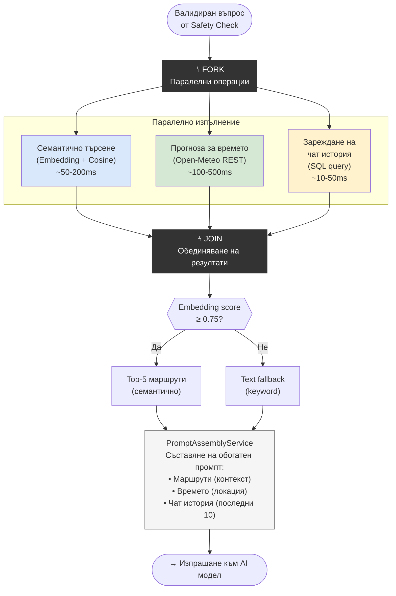

# 26 – Activity Diagram: Паралелно извличане (Fork/Join)

## Описание

**Тип:** Activity Diagram – Паралелно извличане с Fork/Join

**Паралелни операции:**

| Задача | Timeout | Зависимост |
|--------|---------|-----------|
| Embedding similarity search | 200ms | eco.json embeddings |
| Open-Meteo weather fetch | 500ms | GPS координати от eco.json |
| Chat history retrieval | 50ms | SQL Server (EF Core) |

**Fork/Join стратегия:**
- `Task.WhenAll()` в .NET за паралелност
- Ако Open-Meteo timeout → продължава без времето (graceful degradation)
- Ако embedding неуспешен → fallback към text search
- Join изчаква всички или max 800ms timeout
