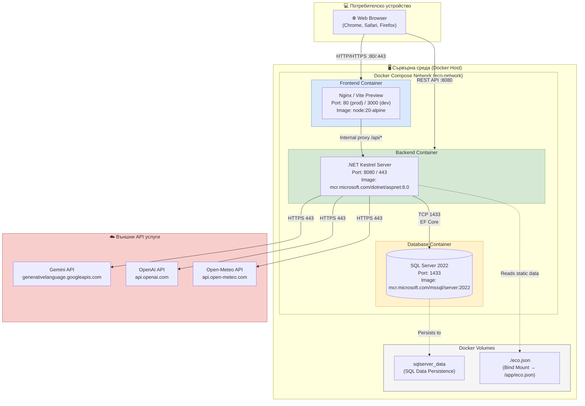

# 27 – Deployment Diagram: Docker Compose инфраструктура

## Описание

**Тип:** Deployment Diagram – Docker Compose инфраструктура

| Контейнер | Image | Port | Volumes |
|-----------|-------|------|---------|
| frontend | node:20-alpine / nginx:alpine | 80, 3000 | – |
| backend | mcr.../aspnet:8.0 | 8080, 443 | eco.json bind mount |
| db | mcr.../mssql/server:2022 | 1433 | sqlserver_data volume |

**Docker Compose файлове:**
- `docker-compose.yml` – Development среда
- `docker-compose.prod.yml` – Production с HTTPS и оптимизации

**Мрежа:** `eco-network` (bridge) – контейнерите комуникират по hostname (frontend, backend, db)
