# 28 – CI/CD Pipeline Диаграма

```mermaid
flowchart LR
    Dev["👨‍💻 Разработчик\ngit push / PR"]

    subgraph GitHub["GitHub Actions"]
        Trigger["Trigger\npush to main/dev\nPR created"]

        subgraph BuildTest["Build & Test Stage"]
            Checkout["actions/checkout@v4"]
            SetupDotnet["setup-dotnet@v4\n.NET 8 SDK"]
            Restore["dotnet restore"]
            Build["dotnet build --no-restore"]
            Test["dotnet test\n(xUnit + EF In-Memory)"]
            SetupNode["setup-node@v4\nNode 20"]
            NpmCI["npm ci"]
            EslintCheck["npm run lint\n(ESLint)"]
            ViteBuild["npm run build\n(Vite TypeScript)"]
        end

        subgraph SecurityScan["Security Stage"]
            Trivy["Trivy vulnerability scan\n(Docker images)"]
            DotnetSecurity["dotnet list package\n--vulnerable"]
        end

        subgraph DockerBuild["Docker Build Stage"]
            BuildBackend["docker build\n./EcoTrails.Api"]
            BuildFrontend["docker build\n./EcoTrails.Client"]
            PushRegistry["docker push\nghcr.io / Docker Hub"]
        end

        subgraph Deploy["Deploy Stage"]
            DockerCompose["docker compose -f\ndocker-compose.prod.yml up -d"]
            HealthCheck["curl /health\n(200 OK?)"]
            EFMigrate["dotnet ef database update\n(auto-migrations)"]
        end
    end

    Notify["📧 Slack / Email\nNotification"]

    Dev --> Trigger
    Trigger --> Checkout
    Checkout --> SetupDotnet
    SetupDotnet --> Restore
    Restore --> Build
    Build --> Test
    Test --> SetupNode
    SetupNode --> NpmCI
    NpmCI --> EslintCheck
    EslintCheck --> ViteBuild
    ViteBuild --> Trivy
    Trivy --> DotnetSecurity
    DotnetSecurity --> BuildBackend
    BuildBackend --> BuildFrontend
    BuildFrontend --> PushRegistry
    PushRegistry --> DockerCompose
    DockerCompose --> EFMigrate
    EFMigrate --> HealthCheck
    HealthCheck --> Notify

    style BuildTest fill:#dae8fc,stroke:#6c8ebf
    style SecurityScan fill:#fff2cc,stroke:#d6b656
    style DockerBuild fill:#d5e8d4,stroke:#82b366
    style Deploy fill:#f8cecc,stroke:#b85450
```

## Описание

**Тип:** CI/CD Pipeline Activity Diagram

| Фаза | Инструменти | Описание |
|------|------------|----------|
| Build & Test | GitHub Actions, .NET 8 SDK, xUnit | Компилиране + unit тестове |
| Frontend Build | Node 20, Vite, ESLint | TypeScript проверка + bundle |
| Security | Trivy, dotnet audit | Уязвимости в зависимости |
| Docker Build | Docker + ghcr.io | Мулти-стейдж build образи |
| Deploy | Docker Compose + health check | Blue-green deployment |
| DB Migration | EF Core Migrations | Автоматично при deploy |

**Тригъри:**
- `push` към `main` → full pipeline + deploy
- `push` към `dev` → build + test само
- `pull_request` → build + test + security scan
