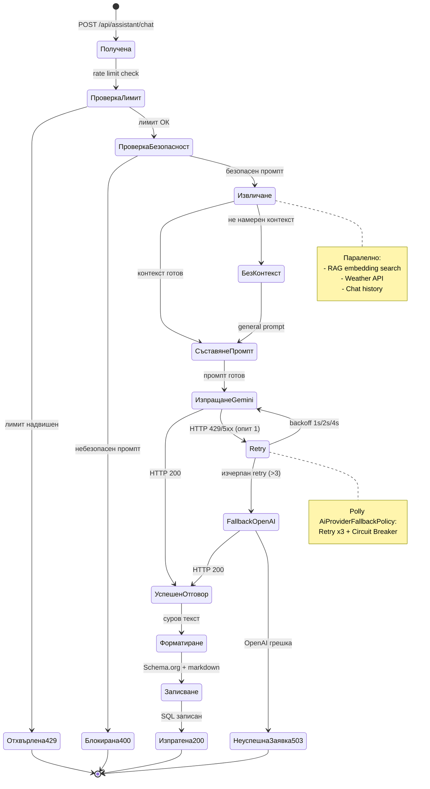

# 29 – State Diagram: Жизнен цикъл на AI заявка

## Описание

**Тип:** State Diagram – Жизнен цикъл на AI заявка

| Състояние | Описание | Следващо |
|-----------|----------|----------|
| Получена | HTTP заявка пристигна | Rate limit check |
| Отхвърлена429 | Rate limit надвишен | [*] → 429 |
| Блокирана400 | Safety violation | [*] → 400 |
| Извличане | RAG паралелно извличане | Съставяне |
| ИзпращанеGemini | HTTP POST към Gemini | Успех / Retry |
| Retry | Exponential backoff (Polly) | Gemini retry / Fallback |
| FallbackOpenAI | OpenAI gpt-4o-mini | Успех / 503 |
| Форматиране | ResponseCompositionService | Записване |
| Изпратена200 | HTTP 200 с отговор | [*] |
