# 30 – Threat Modeling (STRIDE)

```mermaid
graph TB
    subgraph Actors["Заплашителни актьори"]
        Attacker["🏴‍☠️ Атакуващ\n(External)"]
        Insider["👤 Вътрешен актьор\n(Compromised user)"]
        Bot["🤖 Автоматизирани\nботове"]
    end

    subgraph Threats["STRIDE Заплахи"]

        subgraph Spoofing["S – Spoofing (Фалшификация)"]
            T1["T1: JWT Token Forgery\nФалшив токен за достъп"]
            T2["T2: Password Brute Force\n/api/auth/login"]
        end

        subgraph Tampering["T – Tampering (Манипулация)"]
            T3["T3: SQL Injection\nчрез параметри на заявка"]
            T4["T4: eco.json Tampering\nМанипулация на статичен файл"]
        end

        subgraph Repudiation["R – Repudiation (Отричане)"]
            T5["T5: Липса на audit log\nза admin операции"]
        end

        subgraph InfoDisclosure["I – Information Disclosure"]
            T6["T6: JWT Secret Leak\nв environment variables"]
            T7["T7: AI Response Leakage\nСистемен промпт разкрит"]
        end

        subgraph DoS["D – Denial of Service"]
            T8["T8: Rate Limit Bypass\nChunked HTTP smuggling"]
            T9["T9: LLM Token Flooding\nМасивни AI заявки"]
        end

        subgraph EoP["E – Elevation of Privilege"]
            T10["T10: IDOR на Favorites\n/api/favorites/{id}"]
            T11["T11: Admin Role Escalation\nManipulated JWT claims"]
        end
    end

    subgraph Mitigations["Мерки за защита"]
        M1["✅ BCrypt хеш на пароли\n(Identity HashPassword)"]
        M2["✅ Rate Limiting\n(auth: 10/min, assistant: 30/min)"]
        M3["✅ EF Core параметризирани заявки\n(no raw SQL)"]
        M4["✅ JWT валидация\n(алгоритъм, издател, expiry)"]
        M5["✅ Safety Check\n(prompt injection блокиране)"]
        M6["✅ Authorization checks\n(UserId claim validation)"]
        M7["⚠️ Препоръка: Audit Log\nза admin операции"]
        M8["⚠️ Препоръка: HTTPS only\n+ HSTS header"]
    end

    Attacker --> T1
    Attacker --> T2
    Bot --> T8
    Bot --> T9
    Insider --> T10
    Insider --> T11

    T1 --> M4
    T2 --> M1
    T2 --> M2
    T3 --> M3
    T6 --> M8
    T7 --> M5
    T8 --> M2
    T9 --> M2
    T10 --> M6
    T11 --> M6
    T5 --> M7

    style Spoofing fill:#fce4ec,stroke:#E91E63
    style Tampering fill:#fff3e0,stroke:#FF9800
    style InfoDisclosure fill:#e8f5e9,stroke:#4CAF50
    style DoS fill:#e3f2fd,stroke:#2196F3
    style EoP fill:#f3e5f5,stroke:#9C27B0
    style Repudiation fill:#fafafa,stroke:#666
    style Mitigations fill:#f5f5f5,stroke:#333
```

## Описание

**Тип:** Threat Modeling – STRIDE анализ

| Категория | Заплахи | Статус |
|-----------|---------|--------|
| Spoofing | JWT forgery, Brute force | ✅ Защитено |
| Tampering | SQL injection, File tampering | ✅ Защитено |
| Repudiation | Липса на admin audit | ⚠️ Препоръчано |
| Info Disclosure | JWT secret, Prompt leakage | ⚠️ Частично |
| DoS | Rate limit bypass, LLM flooding | ✅ Защитено |
| Elevation of Privilege | IDOR, Role escalation | ✅ Защитено |

**OWASP Top 10 покритие:** A01 (Access Control), A02 (Cryptography), A03 (Injection), A07 (Auth failures)
