# 31 – Стратегия за тестване (Testing Pyramid)

```mermaid
graph TB
    subgraph Pyramid["Пирамида на тестването – EcoProject"]

        subgraph E2E["🔼 E2E / Manual (Върх)"]
            E2E1["Ръчни тестове\nChrome DevTools\nPostman Collections"]
        end

        subgraph Integration["🔷 Integration Tests (Средно ниво)"]
            INT1["TrailsEndpointTests\n(WebApplicationFactory)"]
            INT2["AssistantChatRateLimitTests\n(In-Memory DB)"]
            INT3["CommunityPostsEndpointTests\n(TestAuthHandler)"]
            INT4["FavoritesEndpointTests\n(TestDbContextFactory)"]
            INT5["AuthProfileAndPasswordTests\n(Identity stack)"]
            INT6["HealthEndpointTests"]
        end

        subgraph Unit["🔵 Unit Tests (Основа)"]
            U1["TrailRepositoryTests\n(EF In-Memory)"]
            U2["AssistantMessageRepositoryTests"]
            U3["FavoritesRepositoryTests"]
            U4["AiProviderFallbackPolicyTests\n(Polly)"]
            U5["AssistantPromptAssemblyServiceTests"]
            U6["AssistantRetrievalServiceTests\n(FakeOpenAiAssistantService)"]
            U7["AssistantResponseCompositionServiceTests"]
            U8["AssistantSecurityAndProvenanceTests"]
            U9["TrailSearchTextMatcherTests"]
            U10["TrailsSummaryEndpointTests"]
            U11["OpenAiAssistantServiceFallbackOrchestrationTests"]
            U12["AssistantAuthorizationTests"]
            U13["AssistantRateLimitTests"]
        end
    end

    subgraph Infrastructure["🔧 Test Infrastructure"]
        TI1["TestDbContextFactory\nSqlite In-Memory"]
        TI2["TestAuthHandler\nJWT mock"]
        TI3["TrailsSummaryApiFactory\nWebApplicationFactory"]
        TI4["FakeOpenAiAssistantService\nAI mock"]
    end

    Unit --> Integration
    Integration --> E2E

    style E2E fill:#f8cecc,stroke:#b85450
    style Integration fill:#fff2cc,stroke:#d6b656
    style Unit fill:#d5e8d4,stroke:#82b366
    style Infrastructure fill:#dae8fc,stroke:#6c8ebf
```

## Описание

**Тип:** Testing Strategy Diagram – Пирамида на тестването

| Ниво | Брой тестове | Технология | Скорост |
|------|-------------|-----------|---------|
| Unit | ~60+ теста | xUnit + EF Core In-Memory | < 1s |
| Integration | ~40+ теста | WebApplicationFactory + SQLite | 5-30s |
| E2E / Manual | Ограничен набор | Postman / Chrome | Ръчно |

**Test Infrastructure:**
- `TestDbContextFactory` – SQLite in-memory за изолирани тестове
- `TestAuthHandler` – Mock JWT authentication без реален сървър
- `TrailsSummaryApiFactory` – Пълен HTTP стек с mock services
- `FakeOpenAiAssistantService` – Детерминиран AI mock за тестване на fallback

**Покритие:** Unit тестове покриват всички service слоеве. Integration тестове проверяват HTTP контракти и rate limiting.
