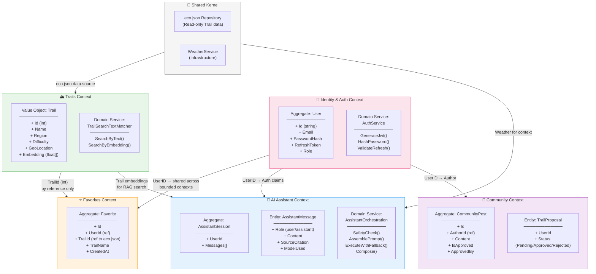

# 32 – Domain-Driven Design (DDD): Bounded Contexts

## Описание

**Тип:** DDD Bounded Context Map

| Контекст | Aggregate Root | Описание |
|----------|---------------|----------|
| Identity & Auth | User | ASP.NET Identity + JWT |
| Trails | Trail (Value Object) | eco.json static data |
| Favorites | Favorite | User ↔ Trail N:M |
| AI Assistant | AssistantSession | AI orchestration pipeline |
| Community | CommunityPost | UGC + moderation |
| Shared Kernel | eco.json + Weather | Read-only инфраструктура |

**Интеграция между контексти:** Само чрез ID референции – няма директни обектни зависимости между Bounded Contexts.
