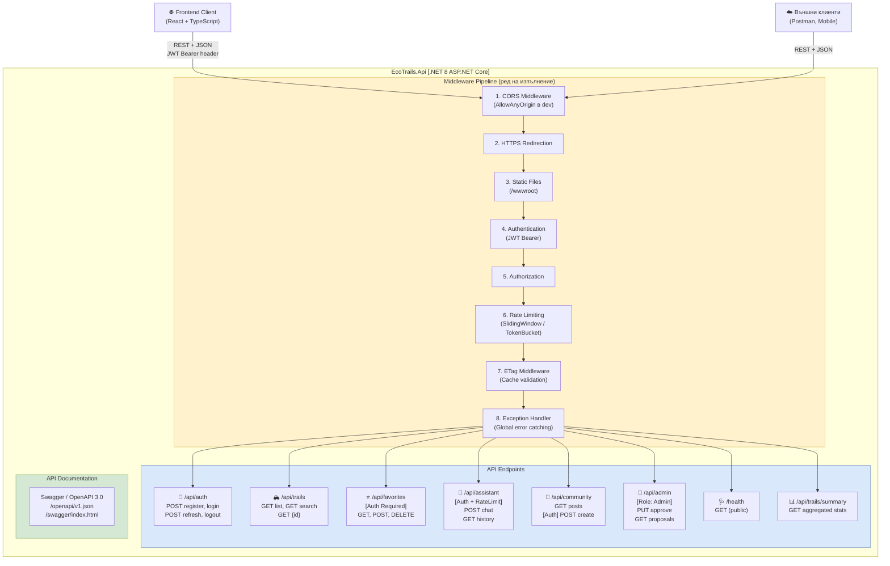

# 33 – API Component Diagram (EcoTrails .NET 8 Web API)

## Описание

**Тип:** API Component Diagram

| Endpoint Group | Auth | Rate Limit | Описание |
|----------------|------|-----------|----------|
| `/api/auth` | Публичен | auth: 10/min | Регистрация + JWT |
| `/api/trails` | Публичен | – | Маршрути + ETag кеш |
| `/api/favorites` | JWT Required | – | CRUD любими маршрути |
| `/api/assistant` | JWT Required | assistant: 30/min | AI чат с RAG |
| `/api/community` | Mixed | – | Community posts |
| `/api/admin` | Role: Admin | – | Одобрение + управление |
| `/health` | Публичен | – | Health check endpoint |

**Middleware ред:** Всяка заявка минава през целия pipeline в определен ред преди да достигне контролера.
