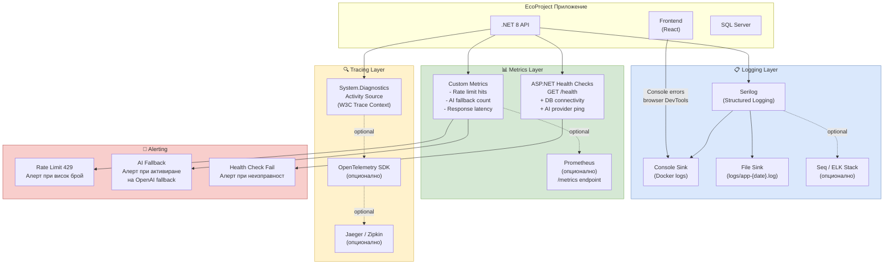

# 34 – Архитектура на наблюдаемостта (Observability)

## Описание

**Тип:** Observability Architecture Diagram

| Аспект | Инструмент | Статус |
|--------|-----------|--------|
| Structured Logging | Serilog + Console/File sinks | ✅ Внедрено |
| Health Checks | ASP.NET Core Health Checks `/health` | ✅ Внедрено |
| Rate Limit Monitoring | Custom middleware counters | ✅ Внедрено |
| Metrics | Prometheus endpoint | ⚠️ Опционално |
| Distributed Tracing | OpenTelemetry + Jaeger | ⚠️ Опционално |
| Log Aggregation | Seq / ELK Stack | ⚠️ Опционално |

**Текущи log нива:** Error (prod) → Warning (staging) → Information (dev) → Debug (local)
