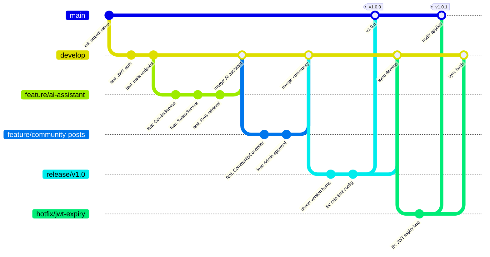

# 35 – Git стратегия и Branching модел

## Описание

**Тип:** Git Branching Strategy (Git Flow)

| Клон | Описание | Merge target |
|------|----------|-------------|
| `main` | Production-ready код | – |
| `develop` | Интеграционен клон | main (при release) |
| `feature/*` | Нови функционалности | develop |
| `release/*` | Release подготовка | main + develop |
| `hotfix/*` | Спешни production поправки | main + develop |

**Правила:**
- `main` → само чрез PR с code review
- `feature/*` → branch от `develop`, merge чрез PR
- `hotfix/*` → branch от `main`, merge в `main` AND `develop`
- Semantic versioning: `v{major}.{minor}.{patch}`
- Всеки merge в `main` → автоматичен CI/CD deployment
