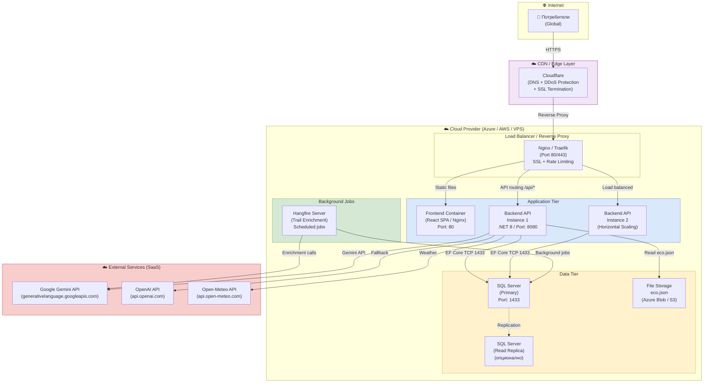

# 36 – Cloud Architecture Диаграма

## Описание

**Тип:** Cloud Architecture Diagram

| Tier | Компонент | Мащабируемост |
|------|-----------|--------------|
| CDN/Edge | Cloudflare | Global edge network |
| Load Balancer | Nginx/Traefik | Horizontal scaling ready |
| Frontend | React SPA / Nginx | Stateless, CDN кешируем |
| Backend API | .NET 8 Kestrel | Horizontal (2+ instances) |
| Database | SQL Server Primary/Replica | Vertical + Read replicas |
| Background | Hangfire | Единствен scheduler node |
| External | Gemini, OpenAI, Open-Meteo | SaaS – няма управление |

**Deployment target:** Docker Compose (текущо) → Kubernetes (следваща фаза)
