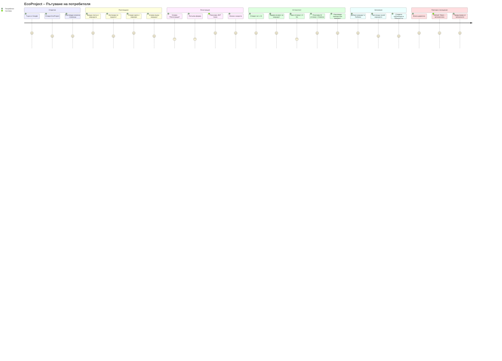

# 37 – User Journey Map

## Описание

**Тип:** User Journey Map

| Фаза | Потребителски опит | Болкови точки |
|------|------------------|---------------|
| Откритие | ⭐⭐⭐⭐⭐ | SEO зависимост |
| Разглеждане | ⭐⭐⭐⭐⭐ | Много маршрути = нужда от филтри |
| Регистрация | ⭐⭐⭐ | Форма е стъпка пред съдържанието |
| AI Асистент | ⭐⭐⭐⭐⭐ | ~2-3s latency може да уморява |
| Запазване | ⭐⭐⭐⭐⭐ | Лесно и интуитивно |
| Повторно посещение | ⭐⭐⭐⭐⭐ | Refresh token = безпроблемно |

**Ключови моменти на радост (Joy moments):**
- AI отговор с конкретни маршрути и citations
- Интерактивна карта с реални GPS маршрути
- Offline PWA – работи без интернет за запазени данни
