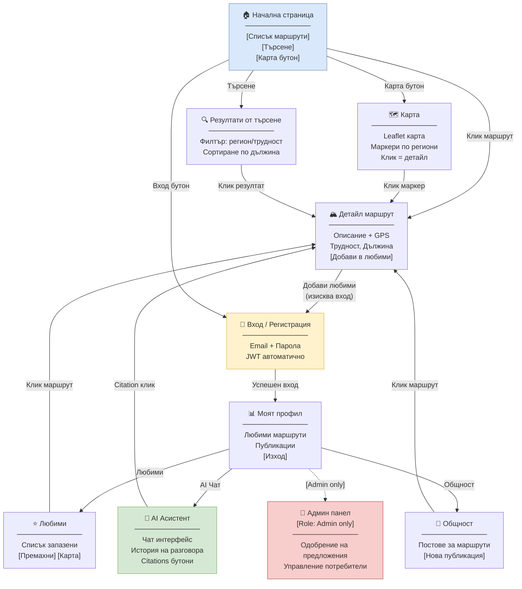

# 38 – Wireflow Диаграма: UI/UX навигационен поток

## Описание

**Тип:** Wireflow Diagram – UI/UX навигационен поток

| Страница | Достъп | Ключова функция |
|----------|--------|----------------|
| Начална страница | Публичен | Списък + търсене |
| Карта | Публичен | Географска визуализация |
| Детайл маршрут | Публичен | Пълна информация |
| Вход/Регистрация | Публичен | JWT auth |
| Моят профил | Auth required | Dashboard |
| Любими | Auth required | Запазени маршрути |
| AI Асистент | Auth required | Чат + RAG |
| Общност | Mixed | UGC posts |
| Админ панел | Role: Admin | Модерация |

**Ключови UX потоци:**
1. Анонимен → разглежда → харесва → регистрира се → добавя в любими
2. Регистриран → задава въпрос на AI → получава отговор → кликва citation → детайл маршрут
