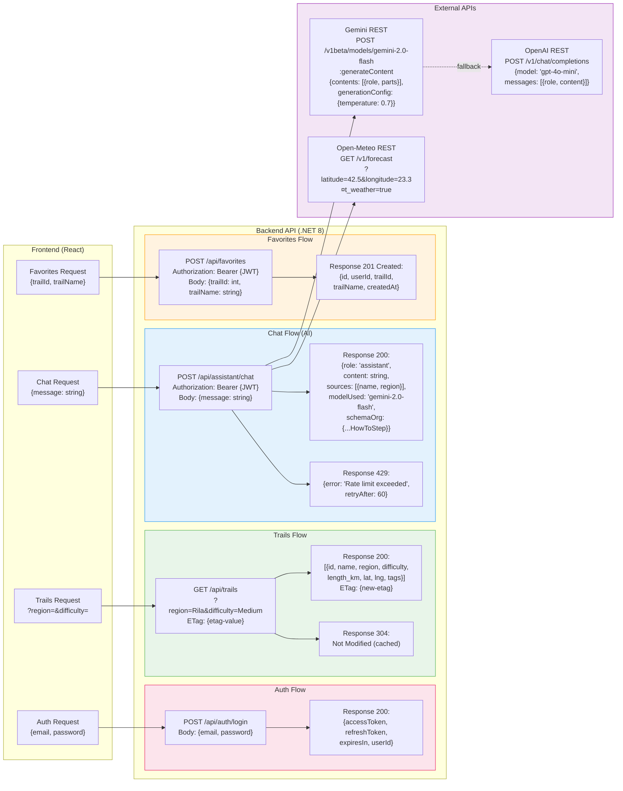

# 39 – Диаграма на API Интеграцията (Payload Map)

## Описание

**Тип:** API Integration / Payload Map

| Endpoint | Method | Auth | Request | Response |
|----------|--------|------|---------|----------|
| `/api/auth/login` | POST | – | `{email, password}` | `{accessToken, refreshToken}` |
| `/api/trails` | GET | – | Query params + ETag | Trail array + ETag |
| `/api/assistant/chat` | POST | JWT | `{message}` | `{content, sources, schemaOrg}` |
| `/api/favorites` | POST | JWT | `{trailId, trailName}` | Created favorite |

**Gemini API формат:**
- `contents[].parts[].text` → промпт
- `generationConfig.temperature: 0.7` → баланс между creativity и accuracy
- `generationConfig.maxOutputTokens: 1024`

**Schema.org в AI Response:** `@type: HowToStep` за структурирани маршрутни инструкции
