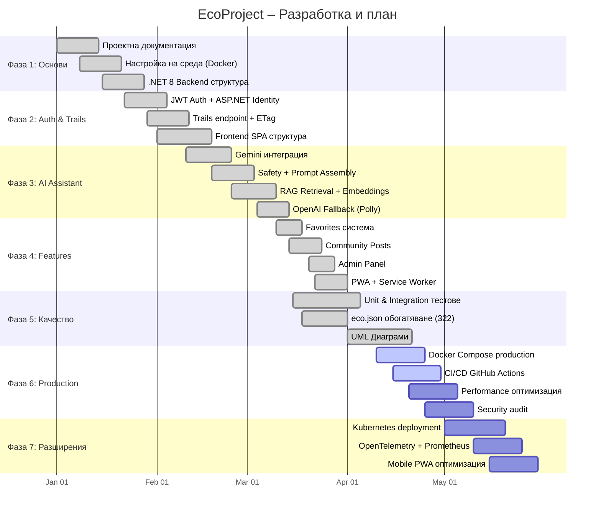

# 40 – Календарен график (Gantt Chart)

## Описание

**Тип:** Gantt Chart – Проектен план

| Фаза | Период | Статус |
|------|--------|--------|
| Фаза 1: Основи | Яну 2026 | ✅ Завършена |
| Фаза 2: Auth & Trails | Яну-Фев 2026 | ✅ Завършена |
| Фаза 3: AI Assistant | Фев-Мар 2026 | ✅ Завършена |
| Фаза 4: Features | Мар-Апр 2026 | ✅ Завършена |
| Фаза 5: Качество | Мар-Апр 2026 | ✅ Завършена |
| Фаза 6: Production | Апр-Май 2026 | 🔄 В процес |
| Фаза 7: Разширения | Май 2026 | 📅 Планирано |

**Критичен път:** AI Assistant (Фаза 3) → Quality (Фаза 5) → Production (Фаза 6)
