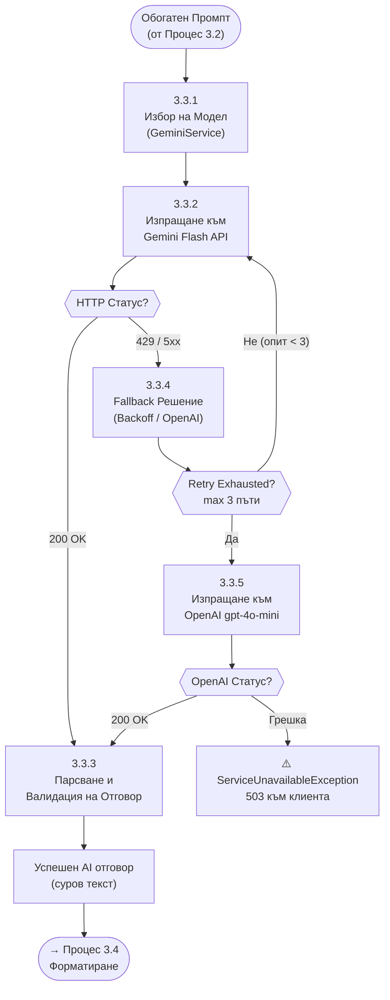

# 23 – DFD Level 3: Декомпозиция на Процес 3.3 (Моделна Екзекуция и Fallback)

## Описание

**Тип:** DFD Level 3 – Декомпозиция на Процес 3.3 (Моделна Екзекуция)

| Под-процес | Описание |
|-----------|----------|
| 3.3.1 Избор на модел | Проверява кеш, избира Gemini Flash като primary |
| 3.3.2 Изпращане | HTTP POST към Gemini REST API с timeout 30s |
| 3.3.3 Парсване | Валидира response структурата, извлича text |
| 3.3.4 Fallback | Exponential backoff: 1s → 2s → 4s между retry |
| 3.3.5 OpenAI fallback | При изчерпан retry – gpt-4o-mini с адаптиран промпт |

**Backoff стратегия:** `AiProviderFallbackPolicy` (Polly) с:
- Retry count: 3
- Wait: 1s, 2s, 4s (exponential)
- Circuit breaker: 5 грешки за 30s → open circuit за 60s
