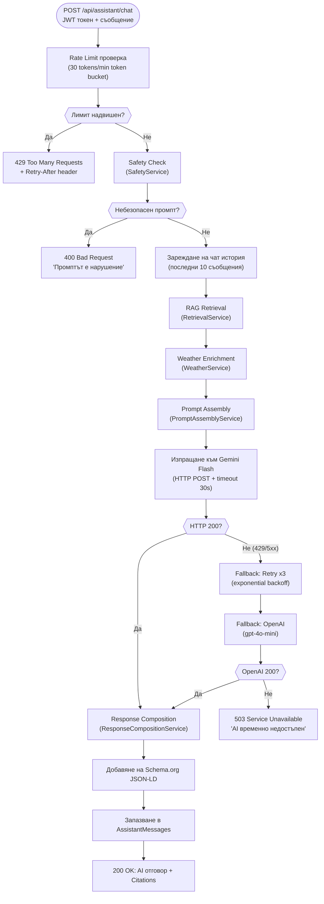

# 25 – Activity Diagram: AI Response (Пълен поток на AI отговор)

## Описание

**Тип:** Activity Diagram – Пълен поток на AI заявка

**Компоненти по ред на изпълнение:**

1. **Rate Limiting** – Token bucket: 30 req/min, window 1 min (`AssistantRateLimitMiddleware`)
2. **Safety Check** – Regex + AI safety prompt; блокира: injection, violence, OOD теми
3. **Retrieval** – RAG pipeline: embedding → cosine similarity → top-5 маршрути
4. **Assembly** – Структуриран system prompt с контекст, история, времето
5. **Model Execution** – Gemini Flash primary; Polly retry x3; OpenAI fallback
6. **Composition** – Markdown формат + Schema.org HowToStep JSON-LD
7. **Persistence** – Всяко съобщение (user + assistant) записано в SQL Server
