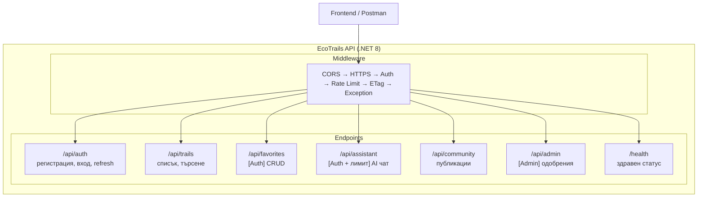

# Диаграма на компонентите – API Endpoints

```mermaid
graph TB
    Клиент["Frontend / Postman"]

    subgraph API["EcoTrails API (.NET 8)"]
        subgraph Middleware["Middleware"]
            MW["CORS → HTTPS → Auth → Rate Limit → ETag → Exception"]
        end

        subgraph Endpoints["Endpoints"]
            Е1["/api/auth\nрегистрация, вход, refresh"]
            Е2["/api/trails\nсписък, търсене"]
            Е3["/api/favorites\n[Auth] CRUD"]
            Е4["/api/assistant\n[Auth + лимит] AI чат"]
            Е5["/api/community\nпубликации"]
            Е6["/api/admin\n[Admin] одобрения"]
            Е7["/health\nздравен статус"]
        end
    end

    Клиент --> MW
    MW --> Е1
    MW --> Е2
    MW --> Е3
    MW --> Е4
    MW --> Е5
    MW --> Е6
    MW --> Е7
```
