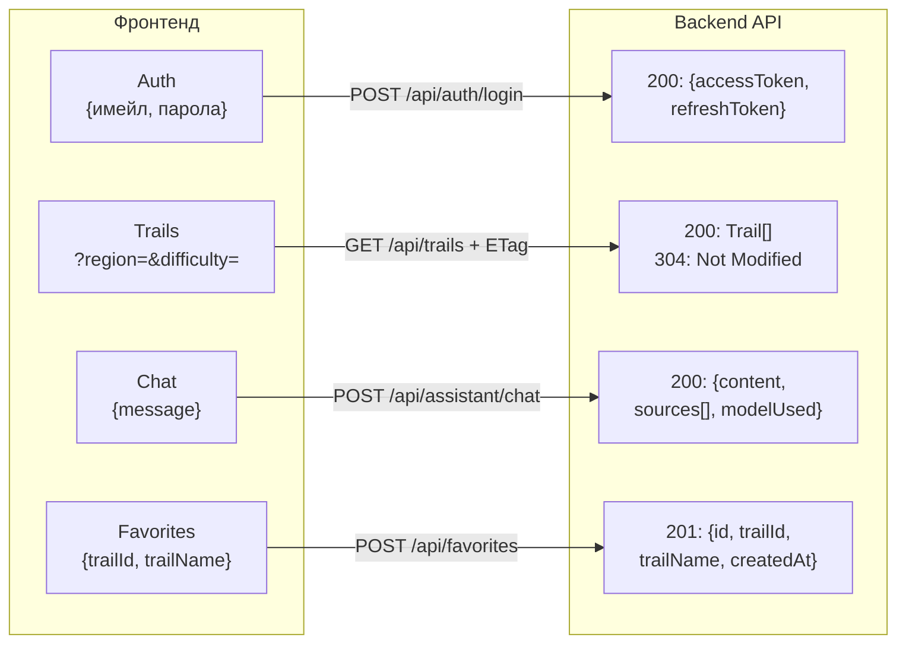

# API Формати на данните (Payload Map)

```mermaid
graph LR
    subgraph Клиент["Фронтенд"]
        А["Auth\n{имейл, парола}"]
        Т["Trails\n?region=&difficulty="]
        AI["Chat\n{message}"]
        Л["Favorites\n{trailId, trailName}"]
    end

    subgraph API["Backend API"]
        АО["200: {accessToken,\nrefreshToken}"]
        ТО["200: Trail[]\n304: Not Modified"]
        АИО["200: {content,\nsources[], modelUsed}"]
        ЛО["201: {id, trailId,\ntrailName, createdAt}"]
    end

    А -->|"POST /api/auth/login"| АО
    Т -->|"GET /api/trails + ETag"| ТО
    AI -->|"POST /api/assistant/chat"| АИО
    Л -->|"POST /api/favorites"| ЛО
```
