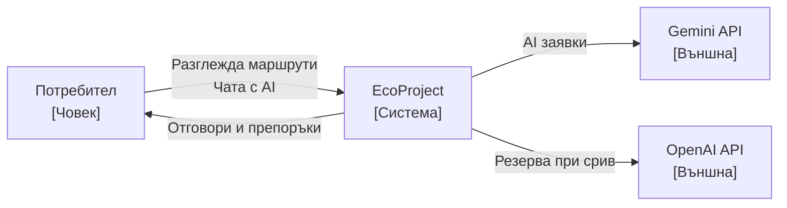

# C4 Ниво 1 – Системен контекст

```mermaid
graph LR
    Потребител["Потребител\n[Човек]"]
    Система["EcoProject\n[Система]"]
    Gemini["Gemini API\n[Външна]"]
    OpenAI["OpenAI API\n[Външна]"]

    Потребител -->|"Разглежда маршрути\nЧата с AI"| Система
    Система -->|"Отговори и препоръки"| Потребител
    Система -->|"AI заявки"| Gemini
    Система -->|"Резерва при срив"| OpenAI
```
