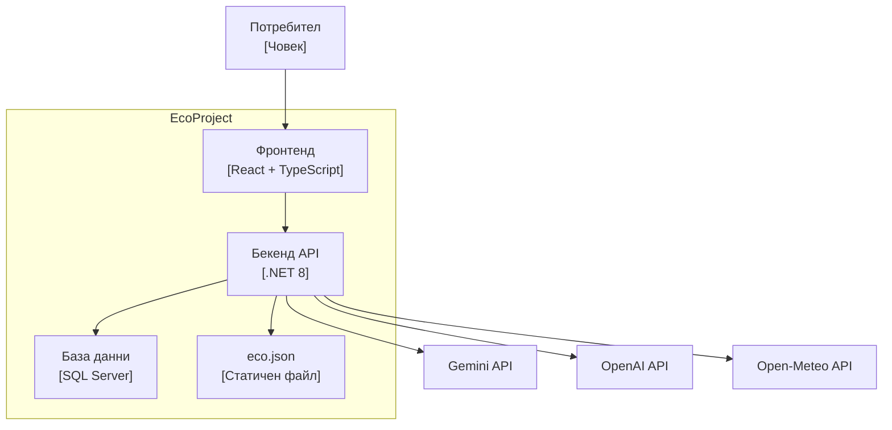

# C4 Ниво 2 – Контейнери

```mermaid
graph TB
    Потребител["Потребител\n[Човек]"]

    subgraph EcoProject["EcoProject"]
        Фронтенд["Фронтенд\n[React + TypeScript]"]
        Бекенд["Бекенд API\n[.NET 8]"]
        БазаДанни["База данни\n[SQL Server]"]
        Маршрути["eco.json\n[Статичен файл]"]
    end

    Gemini["Gemini API"]
    OpenAI["OpenAI API"]
    Времето["Open-Meteo API"]

    Потребител --> Фронтенд
    Фронтенд --> Бекенд
    Бекенд --> БазаДанни
    Бекенд --> Маршрути
    Бекенд --> Gemini
    Бекенд --> OpenAI
    Бекенд --> Времето
```
