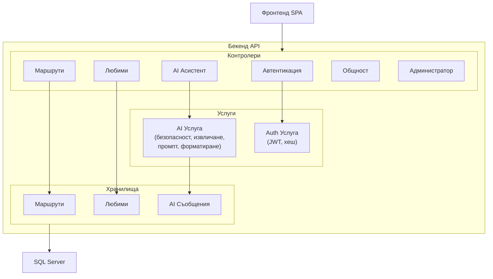

# C4 Ниво 3 – Компоненти на бекенд API

```mermaid
graph TB
    Фронтенд["Фронтенд SPA"]

    subgraph БекендAPI["Бекенд API"]
        subgraph Контролери["Контролери"]
            АутКонтролер["Автентикация"]
            МаршрутиКонт["Маршрути"]
            ЛюбимиКонт["Любими"]
            АиКонтролер["AI Асистент"]
            ОбщностКонт["Общност"]
            АдминКонт["Администратор"]
        end

        subgraph Услуги["Услуги"]
            АиУслуга["AI Услуга\n(безопасност, извличане,\nпромпт, форматиране)"]
            АутУслуга["Auth Услуга\n(JWT, хеш)"]
        end

        subgraph Хранилища["Хранилища"]
            МаршрутХрани["Маршрути"]
            ЛюбимиХрани["Любими"]
            СъобщенияХрани["AI Съобщения"]
        end
    end

    БД["SQL Server"]

    Фронтенд --> Контролери
    АутКонтролер --> АутУслуга
    АиКонтролер --> АиУслуга
    МаршрутиКонт --> МаршрутХрани
    ЛюбимиКонт --> ЛюбимиХрани
    АиУслуга --> СъобщенияХрани
    Хранилища --> БД
```
