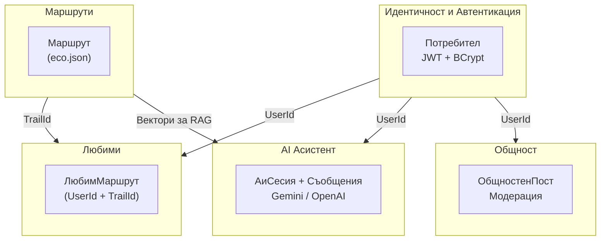

# DDD – Ограничени контексти

```mermaid
graph TB
    subgraph Идентичност["Идентичност и Автентикация"]
        П["Потребител\nJWT + BCrypt"]
    end

    subgraph Маршрути["Маршрути"]
        М["Маршрут\n(eco.json)"]
    end

    subgraph Любими["Любими"]
        Л["ЛюбимМаршрут\n(UserId + TrailId)"]
    end

    subgraph AIАсистент["AI Асистент"]
        С["АиСесия + Съобщения\nGemini / OpenAI"]
    end

    subgraph Общност["Общност"]
        Пост["ОбщностенПост\nМодерация"]
    end

    Идентичност -->|"UserId"| Любими
    Идентичност -->|"UserId"| AIАсистент
    Идентичност -->|"UserId"| Общност
    Маршрути -->|"TrailId"| Любими
    Маршрути -->|"Вектори за RAG"| AIАсистент
```
