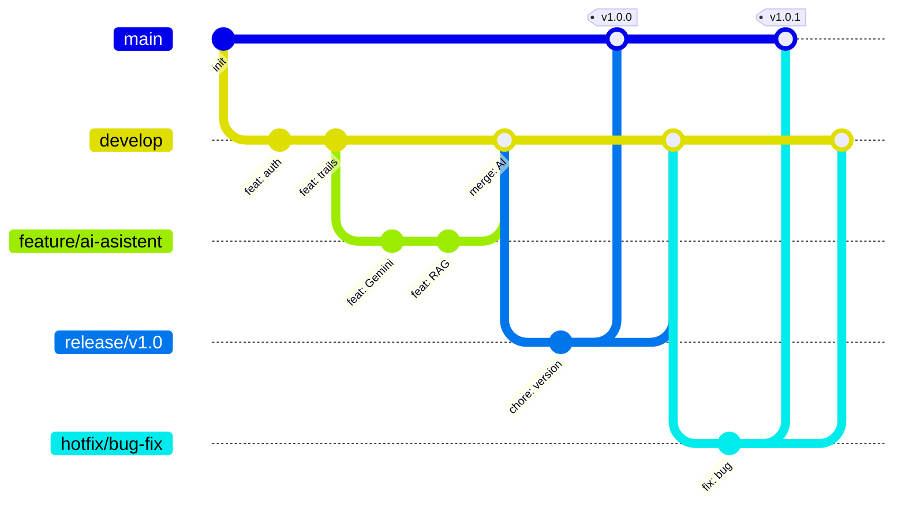

# Git стратегия – Branching модел

```mermaid
gitGraph
    commit id: "init"

    branch develop
    checkout develop
    commit id: "feat: auth"
    commit id: "feat: trails"

    branch feature/ai-asistent
    checkout feature/ai-asistent
    commit id: "feat: Gemini"
    commit id: "feat: RAG"
    checkout develop
    merge feature/ai-asistent id: "merge: AI"

    branch release/v1.0
    checkout release/v1.0
    commit id: "chore: version"
    checkout main
    merge release/v1.0 tag: "v1.0.0"
    checkout develop
    merge release/v1.0

    branch hotfix/bug-fix
    checkout hotfix/bug-fix
    commit id: "fix: bug"
    checkout main
    merge hotfix/bug-fix tag: "v1.0.1"
    checkout develop
    merge hotfix/bug-fix
```
