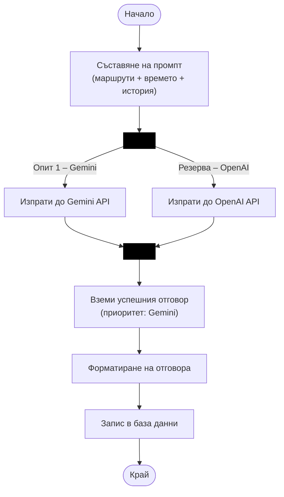

# Активност – AI Оркестрация (Fallback стратегия)

```mermaid
flowchart TD
    Начало([Начало]) --> СъставиПромпт

    СъставиПромпт["Съставяне на промпт\n(маршрути + времето + история)"]
    СъставиПромпт --> FORK1

    FORK1[ ]:::fork
    FORK1 -->|"Опит 1 – Gemini"| ИзпратиGemini["Изпрати до Gemini API"]
    FORK1 -->|"Резерва – OpenAI"| ИзпратиOpenAI["Изпрати до OpenAI API"]

    ИзпратиGemini --> JOIN1
    ИзпратиOpenAI --> JOIN1

    JOIN1[ ]:::join
    JOIN1 --> ИзбериОтговор["Вземи успешния отговор\n(приоритет: Gemini)"]
    ИзбериОтговор --> ФорматирайОтговор["Форматиране на отговора"]
    ФорматирайОтговор --> ЗапишиОтговор["Запис в база данни"]
    ЗапишиОтговор --> Край([Край])

    classDef fork fill:#000,stroke:#000
    classDef join fill:#000,stroke:#000
```
