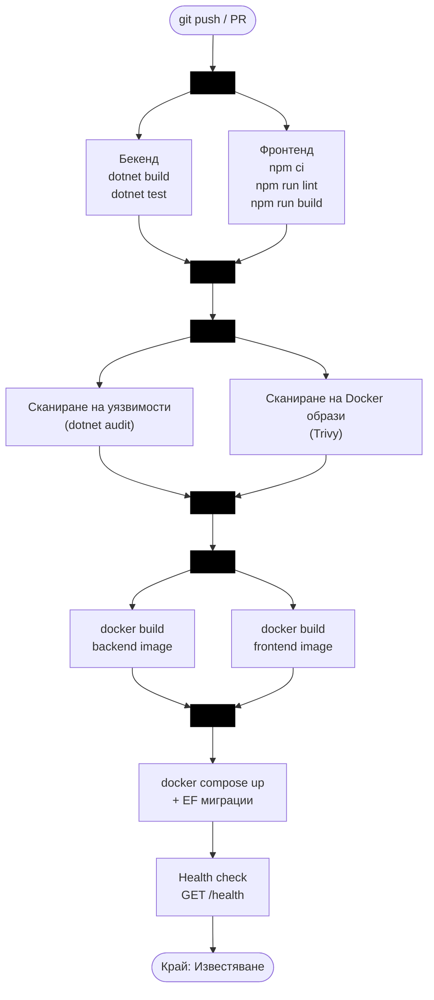

# Активност – CI/CD Тръбопровод

```mermaid
flowchart TD
    Начало([git push / PR]) --> FORK1

    FORK1[ ]:::fork
    FORK1 --> Бекенд["Бекенд\ndotnet build\ndotnet test"]
    FORK1 --> Фронтенд["Фронтенд\nnpm ci\nnpm run lint\nnpm run build"]

    Бекенд --> JOIN1
    Фронтенд --> JOIN1

    JOIN1[ ]:::join
    JOIN1 --> FORK2

    FORK2[ ]:::fork
    FORK2 --> СигурностБекенд["Сканиране на уязвимости\n(dotnet audit)"]
    FORK2 --> СигурностДокер["Сканиране на Docker образи\n(Trivy)"]

    СигурностБекенд --> JOIN2
    СигурностДокер --> JOIN2

    JOIN2[ ]:::join
    JOIN2 --> FORK3

    FORK3[ ]:::fork
    FORK3 --> БилдБекенд["docker build\nbackend image"]
    FORK3 --> БилдФронтенд["docker build\nfrontend image"]

    БилдБекенд --> JOIN3
    БилдФронтенд --> JOIN3

    JOIN3[ ]:::join
    JOIN3 --> Разгръщане["docker compose up\n+ EF миграции"]
    Разгръщане --> ЗдравеПроверка["Health check\nGET /health"]
    ЗдравеПроверка --> Край([Край: Известяване])

    classDef fork fill:#000,stroke:#000
    classDef join fill:#000,stroke:#000
```
