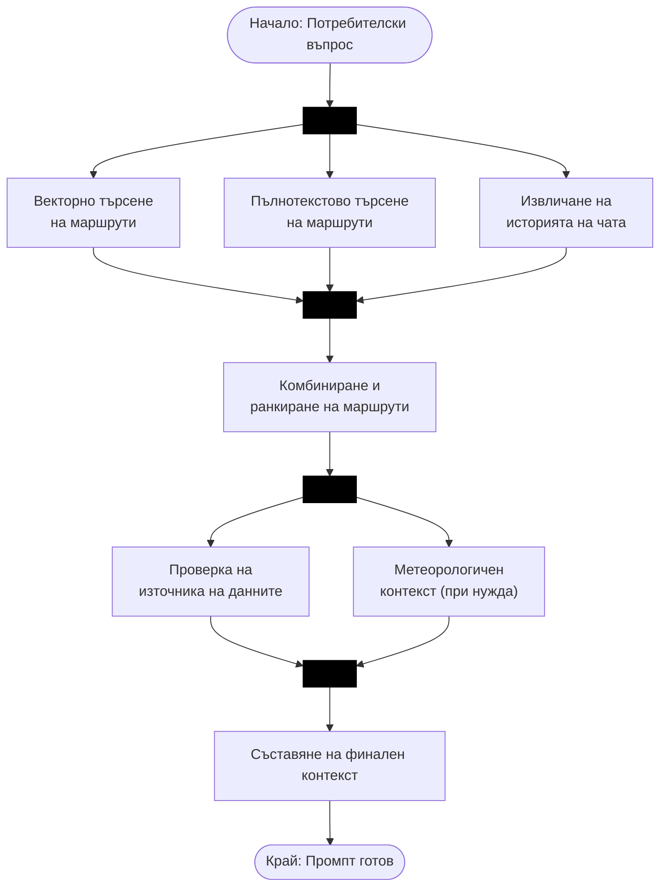

# Активност – RAG Тръбопровод (Паралелно извличане)

```mermaid
flowchart TD
    Начало([Начало: Потребителски въпрос]) --> FORK1

    FORK1[ ]:::fork
    FORK1 --> ВекторноТърсене["Векторно търсене\nна маршрути"]
    FORK1 --> ТекстовоТърсене["Пълнотекстово търсене\nна маршрути"]
    FORK1 --> ИсторияЧат["Извличане на\nисторията на чата"]

    ВекторноТърсене --> JOIN1
    ТекстовоТърсене --> JOIN1
    ИсторияЧат --> JOIN1

    JOIN1[ ]:::join
    JOIN1 --> РангиранеМаршрути["Комбиниране и\nранкиране на маршрути"]
    РангиранеМаршрути --> FORK2

    FORK2[ ]:::fork
    FORK2 --> ПроверкаПроизход["Проверка на\nизточника на данните"]
    FORK2 --> МетеорологиченКонтекст["Метеорологичен\nконтекст (при нужда)"]

    ПроверкаПроизход --> JOIN2
    МетеорологиченКонтекст --> JOIN2

    JOIN2[ ]:::join
    JOIN2 --> СъставиКонтекст["Съставяне на финален контекст"]
    СъставиКонтекст --> Край([Край: Промпт готов])

    classDef fork fill:#000,stroke:#000
    classDef join fill:#000,stroke:#000
```
